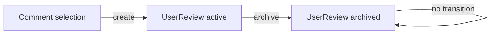

# ADR 001: Store each user review as one JSON document

- Status: Accepted
- Date: 2026-07-11
- Decision owners: spec-viewer maintainers
- Related issue: #99

## Context

The implemented review loop stores one review in a directory containing a
manifest, status, result, instructions, comments, context snapshots, and
optional git worktree metadata. That model was designed as an AI execution
bundle.

The product now needs a smaller boundary: spec-viewer records user-authored
review instructions, while an external skill owns AI execution. Keeping the
execution bundle would make the domain responsible for worktrees, copied
context, progress reporting, and generated prose that the application no
longer needs.

Two incompatible persistence models therefore existed in the planning docs:

1. A folder bundle described by `docs/plans/07-review-loop-plan.md`.
2. A single JSON document proposed for the simplified user-review flow.

Continuing without choosing one would cause repository ports, lifecycle rules,
and transport DTOs to be implemented twice.

## Decision

Adopt a single JSON document as the source of truth for each user review.

```text
<spec-folder>/user-review/
|-- active/
|   `-- <user-review-id>.json
`-- archive/
    `-- <user-review-id>.json
```

The folder bundle model is rejected for the user-review domain. The application
will not create worktrees, context snapshots, instruction Markdown, result
Markdown, or separate status documents as part of creating a user review.
General git/worktree features may exist elsewhere, but they are not properties
of `UserReview`.

## Ubiquitous language

- **UserReview**: immutable review identity plus embedded comment instruction
  snapshots and lifecycle metadata.
- **UserReviewId**: validated identity used as the JSON filename stem.
- **UserReviewTarget**: file or spec scope selected when the review is created.
- **UserReviewComment**: an instruction snapshot with source location hints.
- **active/archive collection**: persistence partitions, not separate
  aggregates.
- **review run**: legacy transport and filesystem terminology only. New domain
  APIs must use `UserReview`.

## Aggregate and lifecycle

One JSON file is one aggregate and one repository persistence unit. Comments
inside a review are snapshots and are not references to mutable comment-store
entities.



The allowed lifecycle is deliberately small:

- Creation produces `status: "active"`, `archivedAt: null`, and equal
  `createdAt`/`updatedAt` values.
- Archive is the only mutation. It produces `status: "archived"`, moves the
  file to `archive/`, and sets equal `updatedAt`/`archivedAt` values.
- Archive is idempotent only when the persisted archived document has the same
  identity and target. Conflicting active and archived copies are reported.
- There are no `inProgress` or `completed` states. AI progress and results are
  outside this aggregate.
- Archived reviews are immutable through the application API.

## Domain contract

The following pseudocode defines the intended domain shape. Rust and TypeScript
implementations may use language-appropriate newtypes and discriminated unions,
but must preserve these invariants.

```typescript
type UserReview = Readonly<{
  id: UserReviewId;
  status: "active" | "archived";
  target: UserReviewTarget;
  comments: readonly UserReviewComment[];
  createdAt: IsoDateTime;
  updatedAt: IsoDateTime;
  archivedAt: IsoDateTime | null;
}>;

type UserReviewTarget =
  | Readonly<{ scope: "file"; specId: SpecId; fileKey: SpecFileKey }>
  | Readonly<{ scope: "spec"; specId: SpecId }>;

type UserReviewSource = Readonly<{
  specId: SpecId;
  fileKey: SpecFileKey;
  filePath: WorkspaceRelativePath;
}>;

type UserReviewComment = Readonly<{
  id: CommentId;
  status: "open" | "resolved";
  source: UserReviewSource;
  blockType: MarkdownBlockType;
  lineStart: PositiveLineNumber;
  lineEnd: PositiveLineNumber;
  textSnippet: NonEmptyText;
  textHash: MarkdownFingerprint;
  body: CommentBody;
  createdAt: IsoDateTime;
  updatedAt: IsoDateTime;
}>;
```

Required invariants:

- New IDs match `^urv_[0-9a-f]{32}$`; legacy IDs are never accepted by the v1
  document decoder.
- A review contains at least one comment and no duplicate comment ID.
- Every comment source has the target `specId`; file-scoped reviews additionally
  require the selected `fileKey`. Application construction and infrastructure
  restoration verify that `filePath` matches the workspace mapping.
- `lineStart <= lineEnd` and both are positive.
- `textSnippet` and `body` are non-empty after normalization.
- Fingerprints and block-type tokens conform to the exact v1 codec rules in the
  migration plan.
- `createdAt <= updatedAt`; archived reviews additionally require
  `updatedAt == archivedAt`, while active reviews require `archivedAt == null`.
- Status and storage collection agree.

## Repository port

The domain owns a `UserReviewRepository` port expressed only in domain values:

```text
create(UserReview active) -> Result<UserReview, UserReviewRepositoryError>
list(UserReviewTarget) -> Result<UserReviewListOutcome, UserReviewRepositoryError>
archive(UserReviewId, UserReviewTarget, archivedAt)
  -> Result<UserReviewArchiveOutcome, UserReviewRepositoryError>
```

```typescript
type UserReviewRepositoryError =
  | Readonly<{ kind: "alreadyExists"; id: UserReviewId }>
  | Readonly<{ kind: "notFound"; id: UserReviewId }>
  | Readonly<{ kind: "targetMismatch"; id: UserReviewId }>
  | Readonly<{ kind: "conflictingCopies"; id: UserReviewId }>
  | Readonly<{ kind: "unavailable" }>;

type UserReviewListOutcome = Readonly<{
  active: readonly UserReview[];
  archived: readonly UserReview[];
  problems: readonly UserReviewRecordProblem[];
}>;

type UserReviewArchiveOutcome = Readonly<{
  userReview: UserReview;
  problems: readonly UserReviewRecordProblem[];
}>;

type UserReviewRecordProblem = Readonly<{
  locator: UserReviewRecordLocator;
  kind:
    | "legacyRecord"
    | "unsupportedRecordVersion"
    | "malformedRecord"
    | "recoverableDuplicate"
    | "conflictingCopies";
}>;
```

The filesystem adapter owns paths, atomic writes, JSON encoding, schema
versioning, directory creation, collision handling, and legacy detection. The
application layer owns loading source comments, resolving Markdown locations,
constructing the aggregate, and orchestrating repository calls.

`UserReviewRecordLocator` is an opaque, display-safe record name. It is not an
OS path and does not expose filesystem semantics to the domain. Infrastructure
maps concrete locations to it at the repository boundary. Domain problem kinds
describe repository records without JSON or folder terminology; infrastructure
and presentation map them to the concrete DTO tokens specified by the migration
plan.

## Persistence schema ownership

`spec-reviewer.user-review.v1` is an infrastructure contract. Serde documents
must not be domain entities. The adapter decodes JSON into a document DTO,
validates its version, and then calls domain constructors.

The canonical JSON document and field requirements are specified in
`docs/plans/09-user-review-json-plan.md`.

The v1 decoder rejects unknown fields at the root and in every nested object.
Unknown schema versions are typed list problems and are never silently coerced.
Create writes a temporary file in `active/`, flushes and syncs it, publishes it
with a no-replace rename, then syncs the directory. Collision never overwrites
an existing record.

### Archive recovery protocol

Archive changes both content and collection, so it is a recoverable repository
transaction rather than one atomic rename:

1. Read and validate the active document and any existing archive document.
2. Write the complete archived document to a temporary file in `archive/`.
3. Flush and sync the file, publish it with a no-replace rename, and sync
   `archive/`.
4. Remove the active file and sync `active/`.

The active file is never removed before the archived document is durable. A
crash after step 3 may leave both copies. Listing and a repeated archive command
resolve that state as follows:

- If identity, target, comments, and `createdAt` match, and the archived
  timestamps form a valid transition from the active value, the archived copy
  wins. Listing returns it once plus a `recoverableDuplicate` problem; a
  repeated archive retries active-file cleanup.
- Any content or target disagreement is `conflictingCopies`. Both files remain
  untouched and mutation fails.
- An archive-only matching record makes archive idempotent.

Temporary files are ignored by normal listing and cleaned on the next
repository operation after their contents and age are checked. All JSON is
pretty printed with a trailing newline.

## Legacy folder bundles

Legacy folder runs are not automatically migrated. Migration would need to
discard execution state and generated artifacts, so doing it implicitly would
be lossy.

The list adapter must:

1. Detect directories below `user-review/active/` and `user-review/archive/`.
2. Return domain kind `legacyRecord`; presentation serializes it as
   `legacyFolderBundle` with an opaque record locator.
3. Exclude the directory from active/archive `UserReview` collections.
4. Refuse archive or overwrite operations targeting the legacy path.

The UI may show the problem as read-only guidance. Users retain the original
folder and can remove or convert it with a future explicit migration tool.

## IPC compatibility

The registered IPC commands are already `create_user_review`,
`list_user_reviews`, and `archive_user_review`; those names remain stable.
The `*_review_run` names exist only inside the current Rust application layer
and are not IPC aliases.

Tauri packages the frontend and backend together, so the first release with the
single-JSON model replaces the current unversioned folder-bundle request and
response payload atomically. The dual-payload compatibility period is therefore
zero releases. In that release, `workspaceMode` and folder/worktree/result
response fields are removed, and all three responses carry the new runtime-
decoded DTO. Persisted legacy folders retain the read-only detection policy
indefinitely; transport compatibility and persisted-data compatibility are
separate concerns.

## Verification strategy

Domain tests cover construction and lifecycle invariants without filesystem or
JSON. Infrastructure tests use temporary directories and fixtures for:

- active and archived v1 JSON documents;
- invalid IDs, ranges, timestamps, duplicate comments, and target mismatch;
- unknown schema versions and malformed JSON;
- legacy active/archive folder bundles;
- conflicting active and archived files;
- atomic create collisions and archive moves.

Presentation contract tests verify the unchanged `*_user_review` command names
and the new payload. Frontend decoder tests reject old folder-bundle payloads
instead of casting them to domain values; no nonexistent command aliases are
tested.

## Consequences

### Benefits

- Persistence aligns with the product boundary: user instructions, not AI
  execution.
- Create maps one aggregate to one atomic publish. Archive uses the documented
  durable publish-and-cleanup protocol and exposes recoverable partial state
  instead of claiming cross-file atomicity.
- Domain state no longer depends on git, worktree paths, Markdown renderers, or
  external-agent progress conventions.
- Frontend and backend share a smaller lifecycle and vocabulary.

### Costs

- Existing folder bundles are read-only legacy data.
- The current completed-before-archive workflow and worktree controls must be
  removed.
- Existing fixtures and DTOs require a coordinated breaking migration.

## Rejected alternative

Retaining the folder bundle was rejected because its additional files model an
AI handoff protocol that an external skill now owns. It also couples the
aggregate to filesystem layout and git execution state, makes archive depend on
agent-written completion files, and creates multiple writable sources of truth
for one review.
