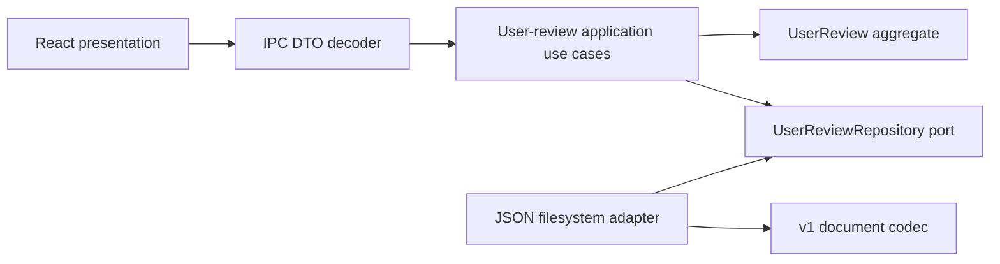

# User Review Single-JSON Migration Plan

This plan implements the decision in
[`ADR 001`](../design/adr-001-user-review-single-json.md). If this document and
the ADR differ, the ADR is authoritative.

## Goal

Store each user review as one versioned JSON document containing user-authored
instructions and stable source-location hints. AI execution belongs to an
external skill, not to spec-viewer.

## Canonical layout

```text
<spec-folder>/user-review/
|-- active/<user-review-id>.json
`-- archive/<user-review-id>.json
```

No worktree, copied context, instructions Markdown, result Markdown, manifest,
or separate status document is generated.

## Version 1 document

```json
{
  "schemaVersion": "spec-reviewer.user-review.v1",
  "id": "urv_018f4c2e6f0a4b18a9d41f72c3e5b607",
  "status": "active",
  "createdAt": "2026-05-06T12:40:00.000Z",
  "updatedAt": "2026-05-06T12:40:00.000Z",
  "archivedAt": null,
  "target": {
    "scope": "file",
    "specId": "001-auth-flow",
    "fileKey": "tasks"
  },
  "comments": [
    {
      "id": "cmt_1",
      "status": "open",
      "source": {
        "specId": "001-auth-flow",
        "fileKey": "tasks",
        "filePath": ".plugin-workspace/.specs/001-auth-flow/tasks.md"
      },
      "blockType": "paragraph",
      "lineStart": 42,
      "lineEnd": 48,
      "textSnippet": "Target text",
      "textHash": "sha256:d4b1ea57",
      "body": "Split this into separate tasks",
      "createdAt": "2026-05-06T12:39:00.000Z",
      "updatedAt": "2026-05-06T12:39:00.000Z"
    }
  ]
}
```

Spec-scoped documents use `target.scope: "spec"`, omit `target.fileKey`, and
carry a complete `source` on every comment.

## Canonical v1 codec rules

- `id` matches `^urv_[0-9a-f]{32}$`. The application generates the suffix
  from a UUID v4 encoded without hyphens. Repository create uses no-replace
  semantics; on collision the application tries a fresh ID at most three times,
  then returns a typed collision error.
- Status tokens are exactly `active` and `archived`. Active documents require
  `archivedAt: null`; archived documents require `updatedAt == archivedAt`.
- Target scope tokens are exactly `file` and `spec`. A file target requires
  `fileKey`; a spec target rejects it.
- Every comment source contains `specId`, `fileKey`, and a slash-separated,
  workspace-relative `filePath`. Absolute paths, empty segments, `.`, and
  `..` are rejected.
- Comment status tokens are exactly `open` and `resolved`. The default create
  flow selects open comments; the codec still preserves an explicitly selected
  resolved snapshot.
- Block tokens are exactly `paragraph`, `heading`, `list_item`,
  `code_block`, `block_quote`, `table`, `thematic_break`, `html`, and
  `other`.
- `textHash` matches `^sha256:[0-9a-f]{8}$` and is the first eight lowercase
  hex characters of SHA-256 over the normalized Markdown block text. A future
  algorithm or length requires a new schema version; v1 is never reinterpreted.
- Timestamps are UTC RFC 3339 with exactly millisecond precision:
  `YYYY-MM-DDTHH:mm:ss.SSSZ`.
- Line numbers are positive, one-based, inclusive, and require
  `lineStart <= lineEnd`.
- The v1 decoder rejects unknown fields at the root and in nested target,
  comment, and source objects. It rejects duplicate JSON object keys.
- The encoder emits UTF-8 pretty JSON with a trailing newline and preserves
  comment order from the create request.

## IPC boundary

The command names remain `create_user_review`, `list_user_reviews`, and
`archive_user_review`. No `*_review_run` IPC aliases are introduced.

```typescript
type UserReviewSummaryDto = Readonly<{
  schemaVersion: "spec-reviewer.user-review.v1";
  id: string;
  status: "active" | "archived";
  target: UserReviewTargetDto;
  recordLocator: string;
  commentCount: number;
  createdAt: string;
  updatedAt: string;
  archivedAt: string | null;
}>;

type UserReviewListProblemDto = Readonly<{
  recordLocator: string;
  kind:
    | "legacyFolderBundle"
    | "unsupportedSchemaVersion"
    | "malformedDocument"
    | "recoverableDuplicate"
    | "conflictingCopies";
  message: string;
}>;
```

Create accepts `workspacePath`, `target`, and `commentIds`; it no longer
accepts `workspaceMode`. List keeps `workspacePath`, `target`, and optional
`correlationId`. Archive keeps `workspacePath`, `target`, and
`userReviewId`. Create/archive return one summary; list returns active and
archived summaries plus typed problems.

The current folder-bundle payload and the new payload are not served in
parallel. Frontend and backend switch together in the first single-JSON release,
so payload compatibility is zero releases while command names remain stable.

## Layer responsibilities



- Domain: IDs, target, comment snapshots, lifecycle, and invariants.
- Application: comment selection, source-location resolution, aggregate
  construction, stale-operation handling, and repository orchestration.
- Infrastructure: JSON DTOs, schema version, paths, atomic create, recoverable
  archive, and legacy detection.
- Presentation: IPC mapping, runtime response decoding, and UI copy/state.

## Migration sequence

### Phase 1: Domain and repository boundary

1. Add the two-state `UserReview` aggregate and validated values.
2. Add the domain-owned repository port.
3. Add v1 document DTOs and strict decode/encode mapping.
4. Add single-file path resolution, atomic create, and recoverable archive
   persistence.

### Phase 2: Application and IPC

1. Build comment instruction snapshots from existing comments and Markdown
   metadata.
2. Replace bundle creation/list/archive orchestration with repository calls.
3. Keep the existing `*_user_review` command names and replace their
   unversioned folder payload with the runtime-decoded summary DTO.
4. Return typed legacy/schema/conflict problems from list operations.

### Phase 3: Frontend

1. Decode the new DTO at the IPC boundary.
2. Reduce status handling to active/archive.
3. Remove worktree execution controls, result summaries, and bundle paths.
4. Keep file/spec target selection and active/archive lists.

### Phase 4: Compatibility cleanup

1. Remove deprecated folder DTO fields, `workspaceMode`, and internal
   `review_run` application naming.
2. Remove folder-bundle writer/renderer/git behavioral fixtures.
3. Retain minimal folder fixtures exclusively for legacy-detection and
   non-destructive regression tests until an explicit migration tool ships.

## Acceptance matrix

| Scenario | Expected result |
| --- | --- |
| Create file review | Exactly one valid JSON file appears in `active/` |
| Create spec review | Comments include their own file paths |
| Archive active review | Archived JSON is durably published before active cleanup |
| Archive archived review | Same matching archived value is returned without rewriting |
| Crash after archive publish | One archived result plus `recoverableDuplicate`; retry cleans active |
| Conflicting active/archive copies | `conflictingCopies`; neither record is deleted |
| Legacy folder found | Typed read-only list problem; directory remains untouched |
| Unknown schema found | Typed unsupported-schema problem; no partial domain object |
| Unknown or duplicate JSON field | Typed malformed-document problem |
| Duplicate ID | Create retries three fresh IDs, then fails without overwrite |
| Target/source mismatch | Decode/archive fails before mutation |
| Dirty git repository | No effect; git state is outside this flow |

## Issue alignment

- #56 defines `UserReviewId`, replacing `UserReviewRunId` terminology.
- #61 validates the v1 JSON document boundary and removes manifest round trips.
- #66 owns the active-to-archived aggregate transition.
- #68 is superseded because Markdown instruction/result rendering is removed.
- #69 defines `UserReviewRepository` for single JSON documents.
- #70 routes create/list/archive use cases through that repository.
- Frontend domain and application work is tracked by #104 and its child issues.
