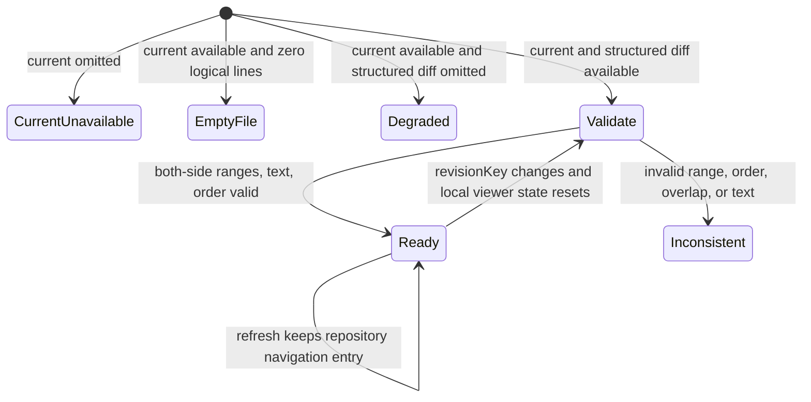
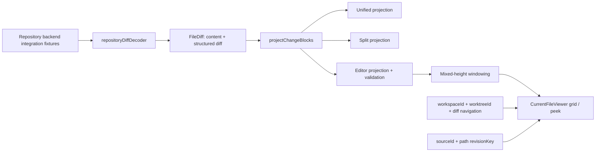

# Issue #197 Editor view and deleted / previous-content peek

Issue: #197

## Goal

Repository file の current snapshot 全文を通常の code として通読できる Editor view を、
既存の Unified / Split view と同じ `FileDiff`・file tab・change navigation 契約へ統合する。
追加行・変更行を current 行の gutter で示し、削除だけの change と置換前の base 行は
明示的な非 comment 対象の peek として展開できるようにする。

## Current-state findings

- `FileReviewViewMode` と toolbar は既に `unified | split | editor` を持ち、
  `App` は同じ active file tab を保ったまま `CurrentFileViewer` と `DiffViewer` を切り替える。
- `CurrentFileViewer` は `newContent.text` を単純に `split("\n")` して行番号を付けるだけで、
  structured diff、gutter、peek、change jump、windowing を扱わない。
- `buildDiffViewModel` は hunk ごとに `hunk-{index}-change-{index}` という安定した
  change ID を生成し、Unified / Split の表示切替で同じ jump target を共有する。
- repository navigation state は `createRepositoryDiffNavigationKey(workspaceId, worktreeId)`、すなわち
  `workspaceId + worktreeId + "diff"` 単位で active path、open tabs、viewer mode、path ごとの jump
  target を保持する。base / snapshot はこの永続navigation keyへ含めず、refreshで同じentryを維持する。
- decoded `RepositoryFileReview` / `FileDiff` は committed、staged、unstaged、untracked を
  合成した current snapshot と、full old/new content、numbered structured hunksを既に供給する。
- binary / large file / diff limit / missing side / unsupported entry は `FileContent` と
  `FileDiffAvailability` の discriminated union で表現されている。
- repository Diff comment の永続化とUIは #198 の責務。ただし #197 の projection は
  current の実在行と表示専用 peek を型で区別し、#198 が peek に anchor を作れない境界を残す。

## Scope

### In scope

- current 全文と structured hunks から、current 行、change gutter、削除 marker、変更前 peek を
  一度の線形走査で生成する純粋な Editor projection。
- 追加行は緑、置換後行は青の gutter bar とし、行番号は常に current snapshot の行番号にする。
- 削除だけの block は挿入位置に「N行削除」、置換 block は変更後行の直前に折りたたんだ
  「変更前 N行」を置き、button で base code を展開・折りたたみできるようにする。
- peek の開閉、モード切替、前/次変更 navigation、ファイルタブ切替を組み合わせても、
  file selection、change ID、current line identity が変わらないようにする。
- text / empty / deleted / renamed / copied / type-changed / added / untracked と、
  binary・omitted・長い行・大きなdiffの安全な状態。
- light / dark theme、keyboard操作、screen reader向け名称、focus表示。
- projection / component / integration test、Storybook、playwright-cli確認、利用Docs更新。

### Out of scope

- repository Diff comment の作成・保存・resolve・双方向jump（#198）。
- backend / IPC schema の変更。現行 `RepositoryFileReview` が返す full content と hunks を使う。
- syntax highlighting、編集可能なtextbox、任意のbase revision選択UIの追加。
- Unified / Split renderer の見た目・intraline algorithm の再設計。

## Design decisions

### 1. Availability と全文表示の契約

Editor が必要とする2入力を独立に判定する。

- **current content unavailable**: `newContent.state === "omitted"`。current全文を表示できないため、reasonを
  明示する非text stateにする。deletedはstatus上current sideが存在しない意図的な例外であり、後述の
  whole-file deletion peek契約を使う。
- **structured diff unavailable**: current contentは`available`だが`structuredDiff.state === "omitted"`。
  current全文は失わず、change gutter / peek / change jumpだけを無効化した`degraded` stateで全行表示する。
  binaryなどcurrent content自体がunavailableな場合と同じempty UIへ潰さない。
- `FileDiffAvailability.kind === "empty"`は「structured hunkが0件」を表すだけであり、
  `newContent.text === ""`とは同義にしない。availableな非空current content + empty availabilityは全文を
  unchangedとして表示し、availableな空fileは0 current linesのempty-file表示にする。
- renamed / copied / typeChangedはhunkが空でもavailableなcurrent全文を表示する。added / untrackedは
  missing old sideを正常な片側変更として扱い、deletedはmissing new sideを正常な片側変更として扱う。

Top-level projection stateは`ready | degraded | emptyFile | currentUnavailable | inconsistent`とし、
availabilityのラベルだけから全文の有無を推論せず、`FileContent`と`StructuredDiff`を個別に見る。

### 2. Source-neutral Editor projection

`src/features/diff/lib/editorViewModel/` に React / repository identity 非依存のprojectionを置く。
入力は `FileDiff`、出力は次の意味を持つ immutable model とする。

- `currentLine`: stable ID `current-line-{lineNumber}`、current line number、text、
  `unchanged | added | modified` gutter kind、`changeId | null`、
  `anchor: { side: "current"; newPath: string; line: number; lineText: string }`。`newPath`がない入力では
  current lineを生成しない。#198はこのdiscriminated fieldからtype-safeにcurrent anchorの
  `side / newPath / line / lineText`を受け取り、peek型からanchorを構築できない。
- `peek`: stable ID `{changeId}-peek`、`deleted | previous`、base line range/text、
  current 上の挿入境界（先頭・特定current行の前・EOF）、`commentability: "none"`。
- top-level state: 上記availability state、ordered change IDs、current line index と change target index。

projection は current content を正本として全行を作り、structured hunks を current line number で
重ねる。change blockの区切りと`hunk-{hunkIndex}-change-{changeIndex}`生成はEditor内へ複製せず、
`diffViewModel`からsource-neutralな共通`projectChangeBlocks`へ抽出する。Unified / Split / Editorは同じ
projector結果を入力にし、全viewでordered change IDs、各IDのold/new line range、change順序が一致する
cross-view invariant testを置く。

- added のみ: 対象 current 行を `added`。
- removed + added: 対象 current 行を `modified` とし、removed 行を `previous` peek にする。
- removed のみ: 次の current 行の直前、または EOF に `deleted` peek を置く。
- deleted file: current 行がなくても、全base行を1つ以上の削除 peek として表示可能にする。根拠は
  backendの`working_tree_diff_covers_staged_deleted_renamed_empty_and_space_paths`がdeletedを
  `change=deleted`、new content=`missingSide`として返す契約、およびtext patchのstructured removed linesと
  old contentを返すrepository detail契約である。backend integration testへold content + removed hunkも
  明示assertし、decoder testを経てwhole-file peekまでtraceする。根拠が満たされなければ推測でold全文を
  change化せず`inconsistent`にする。
- `noNewline` annotation は実在行やcomment targetに数えず、peekの補助説明にのみ使う。

contentの行分割は単一の`splitCanonicalLines`へ統一する。LFとCRLFを同じ論理行へcanonicalizeし、
`\r`を本文末尾へ残さない。final newlineの有無は別metadataとして保持し、`""`は0 logical lines、
末尾改行は余分な空行として生成しない。old/new content、hunk text照合、line hash用textも同じ規則を使う。

各hunkはold/newの双方を検証する。headerだけに依存せず、line kindごとのold/new番号が正の整数か、
context/removed/addedの番号進行、hunk内とhunk間の単調順序、range内、重複なしを検証する。
removed-onlyではdeletion boundaryを`before newStart`（先頭を含む）またはEOFとして確定し、隣接hunkとの
boundary重複・逆転もrejectする。old側もold content範囲とtext、new側もcurrent content範囲とtextを照合する。
範囲外、順序逆転、重複、同じcurrent行への矛盾したoverlay、available contentとhunk textの不整合を
検出した場合は壊れたmarkerを推測せず`inconsistent`にする。UIは理由表示と安全なcurrent全文fallbackを
行い、誤ったchange jump / comment identityを公開しない。

### 3. Display state does not define logical identity

peek の expanded IDs、scroll position、focus は `CurrentFileViewer` 内の表示stateに限定する。
projection row ID、current line number、change IDは開閉で再計算・採番しない。repository navigationの
keyはrefreshでも`workspaceId + worktreeId + "diff"`のままなので、active path / tabs / viewer mode /
jump targetを維持する。一方viewerへ`revisionKey = fileDiff.identity.sourceId + path`（sourceIdはcurrent
snapshotを含む既存identity）を渡し、同じpathの新revisionを受けた時だけexpanded peek、scroll/focus、
window measurement cacheをresetする。base / snapshotをnavigation keyへ混ぜてこのresetを代用しない。

`CurrentFileViewer` に `activeChangeId` と `onActiveChangeIdChange` を追加し、`App` から既存の
path-scoped jump targetを渡す。Editorの前/次移動も同じordered change IDsを使う。削除だけの
changeはmarker、置換/追加は最初のcurrent行をscroll targetにする。peek開閉後は再計算済みの
row offsetで同じsemantic targetへ移動し、active IDそのものは変更しない。

### 4. Mixed-height bounded rendering

projection構築は `O(current lines + hunk lines)`、補助indexも同じ次数に制限する。current code row、
peek summary、annotationは高さが異なるためfixed-height前提を流用せず、rowごとのestimated/measured heightと
cumulative offsetを持つmixed-height windowing helperへ汎用化する。通常はvisible rows + overscanだけを
DOMへ出し、peek展開時もbase行を全件DOMへ一括追加しない。長い1行はwrapせず1 semantic rowのまま横scrollし、
大量行fixtureとは別testで幅・DOM上限を検証する。jumpはsemantic targetを先に決め、materialize後のoffsetへ
scrollし、未計測rowの高さ確定後もtargetがviewport外へずれないよう補正する。

### 5. Accessibility and non-commentable controls

- viewer は path を含む `aria-label`、行一覧は`role="grid"`、windowing中も全論理行数を
  `aria-rowcount`、各render rowを論理位置の`aria-rowindex`で公開する。current行は行番号・変更種別・codeを
  読み上げ可能にし、DOM外targetへのjump後はmaterializeしてfocus/active descendantを移す。
- peek summary は実buttonとして件数・状態（`aria-expanded` / `aria-controls`）を持ち、
  Enter / Spaceで開閉できる。展開したbase行には「変更前」または「削除済み」と旧行番号を付ける。
- marker / summary / 展開base行は `data-commentable="false"`、current実在行だけ
  `data-commentable="true"` と識別できる型・DOM契約にする。
- 緑/青だけへ依存せず gutter bar、accessible label、data kindを併用し、既存theme tokenで
  light / dark双方のcontrastとfocus ringを成立させる。

## System diagrams

### State machine



### Data flow



## Planned file changes

- Add `src/features/diff/lib/changeBlocks/index.ts` and tests
  - Unified / Split / Editor共通のchange block projector、stable ID、old/new range、ordered IDsを所有する。
- Add `src/features/diff/lib/editorViewModel/index.ts`
  - immutable projection types、canonical line split、両side hunk validation、availability state、
    materialization、jump target helpers、#198向けcurrent anchor fields。
- Add `src/features/diff/lib/editorViewModel/__tests__/editorViewModel.unit.test.ts`
  - current全文、追加/置換/削除、複数hunk、先頭/EOF削除、deleted/empty、LF/CRLF/final newline、
    old/new mismatch・順序・重複・範囲、stable IDを検証する。
- Update `src/features/diff/lib/diffViewModel/` and tests
  - 共通change projectorを消費し、3 viewのchange ID/range/order invariantを固定する。
- Add or generalize mixed-height windowing helper and tests under `src/features/diff/lib/`
  - 異種row高、measurement補正、semantic jump、ARIA index、長大1行と20,000行を別fixtureで検証する。
- Update `src/features/diff/components/CurrentFileViewer/index.tsx` and component tests
  - projection rendering、revisionKey local reset、peek state、controlled change navigation、mixed-height
    windowing、degraded/fallback states、ARIA gridを実装・検証する。
- Update `src/features/diff/components/CurrentFileViewer/CurrentFileViewer.stories.tsx`
  - required base stories、degraded/availability states、play functionsを追加する。
- Update `src/app/App/index.tsx`
  - Editorへ既存path-scoped active change ID/callbackとviewer-local `revisionKey`を渡す。
- Update `src/features/repositoryDiff/domain/__tests__/repositoryDiffNavigationState.unit.test.ts`,
  `src/features/repositoryDiff/hooks/useRepositoryDiffNavigationState/__tests__/`, and App interaction coverage
  - navigation keyがworkspaceId + worktreeId + diffでbase/snapshot非依存、refresh後もentry維持、
    revisionKey変更時だけviewer local state resetであることを固定する。
- Update `src-tauri/src/infrastructure/git/repository.rs` tests only
  - committed / staged / unstaged / untrackedの各由来、およびdeletedのold content + removed hunkを
    repository integration testでassertする。production Rust / IPC schemaは変更しない。
- Update `src/lib/api/tauri/__tests__/repositoryDiffDecoder.unit.test.ts` and
  `src/lib/api/tauri/__tests__/repositoryDiff.integration.test.ts`
  - backend fixtureの4由来とdeleted契約が同じdecoded `RepositoryFileReview`へ到達することをassertする。
- Update `src/styles/repository-diff-workspace.css`
  - current gutter、peek rows、mixed-height spacer、horizontal scroll、focus、themes。
- Update `spec-viewer/docs/repository-diff-workspace.md`
  - Editor semantics、availability/degraded、peek、non-commentable boundary、keyboard、性能上限を記録する。

Production Rust / Tauri / IPC schema の変更は計画しない。既存backend契約をtestで明文化し、契約を満たさない
証拠が出た場合は推測でIPCを拡張せずIssue #201/#202との不一致として計画を見直す。

## TDD implementation sequence

1. `tdd` と `testing` スキルを読み、backend integration fixture → decoder → source-neutral projectionの
   traceability testを先にRedで置く。committed / staged / unstaged / untrackedを各fixtureで区別してbackendで
   生成し、decoder後はsource fieldを追加せず同じprojectionへ入ることを固定する。
2. 共通`projectChangeBlocks`をRed → Greenにし、Unified / Splitの既存IDとEditorのID/range/orderが一致する
   cross-view invariant testを通す。
3. canonical splitをLF、CRLF、final newlineあり/なし、空文字の順に三角測量する。
4. current全文 + added-onlyを実装し、replacement、deletion-only、先頭/EOF、whole-file deletionへ広げる。
5. old/new両sideの番号進行、hunk間順序、重複、範囲、text mismatch、deletion boundaryの異常testを追加し、
   `inconsistent`で誤ったchange targetを公開しないことを固定する。
6. current unavailable、structured diff unavailableのdegraded全文、availability empty + 非空content、
   空file、rename/copy/typeChange全文を順に実装する。
7. `coding-standards` と `component` スキルを読み、`CurrentFileViewer`をcontrolled jump contractへ移行する。
   rendering → peek interaction → revisionKey reset → keyboard/ARIA → mixed-height windowingの順でtestを書く。
8. 長大1行fixtureでnowrap/horizontal scrollを、大量行fixtureでDOM cap、ARIA row count/index、未描画change jumpと
   measurement補正を別々に検証する。
9. `App`を配線し、refreshでnavigation entryを維持しつつrevisionKey変更でviewer local stateのみresetする
   integration testと、3モード/tabを跨ぐjump維持testを追加する。
10. Storybook stories/play、CSS、Docsを更新し、playwright-cliで確認する。
11. `typescript-code-review-skill` と必要な`typescript-performance-review-skill`を実行する。

## Acceptance criteria and evidence

- [x] availableなcurrent snapshot全文をSpec以外のtext repository fileでも行番号付きで表示する。
  - Evidence: canonical split/projection unit test + component rendering test + Repository Diff Story。
- [x] current content unavailableとstructured diff unavailableを分離し、後者はdegraded状態でcurrent全文を表示する。
  - Evidence: reason別projection/component parameterized tests。degradedはchange IDs/peekなしもassertする。
- [x] availability emptyと空fileを区別し、rename/copy/typeChangeはhunkなしでもcurrent全文を表示する。
  - Evidence: status × content × availability table testとEdgeCases story。
- [x] committed / staged / unstaged / untrackedをsource別UI分岐なしで同じEditor projectionとして表示する。
  - Evidence: Rust repository integration fixtureで4由来を生成 → decoder/integration testでdecoded shapeを確認 →
    同じsource-neutral projection parameterized testへ渡す一続きのtraceability。UIにsource branchがないreview。
- [x] Unified / Split / Editorが共通projectorを使い、ordered change ID、old/new range、順序が一致する。
  - Evidence: 3 view cross-view invariant test。個別rendererのID生成が残っていないことをreviewする。
- [x] LF / CRLF、final newlineあり/なし、空文字を同じcanonical line契約で扱う。
  - Evidence: canonical split table testとhunk照合test。
- [x] old/new hunkの番号進行、順序、重複、範囲、text、deletion boundaryを検証し、不正入力をrejectする。
  - Evidence: 各invalid classのunit testと`inconsistent` fallback component test。
- [x] addedは緑、replacement current行は青のgutter barとcurrent行番号を持つ。
  - Evidence: projection kind test、DOM data kind / accessible label test、light/dark Storybook確認。
- [x] deletion-onlyは正しいcurrent挿入境界、replacementは変更後行直前にpeekを置き、展開/折畳できる。
  - Evidence: 先頭/中間/EOF/replacement interaction tests。
- [x] deleted whole-fileはbackendが返すold content + removed hunksを根拠にpeek表示する。
  - Evidence: named Rust integration testの追加assert → decoder test → whole-file projection/component test。
- [x] peek型はanchor fieldを持たず、current行だけが#198向け`side/current, newPath, line, lineText`を持つ。
  - Evidence: discriminated union/type-level exhaustiveness + DOM `data-commentable` test。
- [x] refresh後もworkspaceId + worktreeId + diffのnavigation entry、active tab、jump targetを維持し、
  revisionKey変更時だけexpanded peek/scroll/focus/measurement cacheをresetする。
  - Evidence: navigation hook/App integration testとviewer rerender test。
- [x] mixed-height windowingでDOM hard cap、論理`aria-rowcount/aria-rowindex`、未描画target jumpを維持する。
  - Evidence: mixed row height test、20,000行fixture、playwright scroll/jump scenario。
- [x] 長大1行はwrapせず横scrollでき、大量行とは独立の性能契約を持つ。
  - Evidence: long-line component/playwright testとlarge-line-count windowing test。
- [x] keyboardとscreen readerで3モード選択、前/次変更、peek開閉、状態通知を理解・操作できる。
  - Evidence: component accessibility tests、Storybook a11y、playwright keyboard scenario。
- [x] Editor view Docsが実装と一致する。
  - Evidence: `docs/repository-diff-workspace.md` review。

## Storybook coverage

`CurrentFileViewer.stories.tsx` に最低限次を用意する。

- `Default`: context + added + replacement + deletion marker。
- `AllProps`: 複数hunk、先頭/中間/EOF peek、100行以上の全文。
- `AvailabilityMatrix`: current unavailable、structured diff unavailable/degraded、availability empty + 非空、
  empty file、rename/copy/typeChange全文。
- `LineEndings`: LF / CRLF、final newlineあり/なし。
- `InvalidHunks`: old/new範囲、順序、重複、text mismatchのsafe fallback。
- `AddedOrUntracked`: old sideなし、全current行がadded。
- `Deleted`: current sideなし、backend契約相当のwhole-file deletion peekと展開操作。
- `BinaryAndOmitted`: binary / largeFile / diffLimit / unsupportedEntryKindのcurrent unavailable状態。
- `LongSingleLine`: 長大1行のnowrap / horizontal scroll。
- `LargeLineCount`: mixed-height windowing対象の20,000行fixture。
- `KeyboardPeek`: Enter/Space開閉、commentability、ARIA row metadata、console errorなしをassertする。
- Repository Diff workspace storyで file選択 → Editor → peek展開 → refresh → Unified → Split → Editor と操作し、
  active tab/path/change target維持とrevisionKeyによるEditor local resetをassertする。

## Manual UI verification with Storybook + playwright-cli

1. Default / AvailabilityMatrix / Deleted / LongSingleLine / LargeLineCount / KeyboardPeek / workspace storyを開く。
2. light / dark themeで追加=緑、変更=青、peek階層、focus ring、長大1行のhorizontal scrollを確認する。
3. keyboardだけで3モード切替、peek開閉、前/次変更、DOM外changeへのjumpを行う。
4. peek開閉とrefresh前後でcurrent行番号、active change counter、file tabが維持され、Editor local stateだけが
   revisionKey変更でresetされることを確認する。
5. mixed-height peekを跨いでscroll/jumpし、ARIA row count/indexとfocus targetを確認する。
6. 狭いviewport、大規模storyの応答、Storybook a11y、browser consoleに新規error/warningなしを確認する。

## Quality gates

From `spec-viewer/`:

```bash
pnpm test:run
pnpm lint
pnpm typecheck
pnpm format:check
pnpm build-storybook
pnpm build
```

加えて targeted testを先に実行し、最後に全suiteを通す。generated `storybook-static/`、
`visual-actual/`、`visual-baseline/`、`visual-report/` はcommitしない。

## Completion workflow

- [x] このtask checklistと上記acceptance criteriaを完了状態へ更新する。
- [x] implementation commit / PR番号をcompletion noteへ追記する。
- [x] このファイルを `docs/plans/tasks/done/frontend/issue-197-editor-peek.md` へ同名で移動する。
- [x] active frontend group READMEが存在する場合は#197を削除し、
  `docs/plans/tasks/done/README.md` に移動先linkを追加する。

## Implementation checklist

- [x] canonical line splitとold/new hunk validationをTDDで実装する。
- [x] 共通change block projectorと3 view cross-view invariantを実装する。
- [x] Editor projection、stable identity、#198向けcurrent anchor fieldを実装する。
- [x] added / modified gutterとcurrent line numbersを実装する。
- [x] deleted / previous peekとkeyboard開閉を実装する。
- [x] active change navigation、refresh維持、revisionKey local resetを統合する。
- [x] current unavailable / degraded / empty file / renamed / copied / typeChanged stateを実装する。
- [x] mixed-height large diff windowing、ARIA row metadata、long-line横scrollを実装する。
- [x] theme / accessibility / non-commentable DOM契約を実装する。
- [x] backend integration → decoder → source-neutral projectionの4 source traceability testを追加する。
- [x] Storybook stories/play、component/projection/integration testsを追加する。
- [x] playwright-cliでlight/dark、keyboard、mode switching、大規模scrollを確認する。
- [x] Editor view Docsと品質ゲートを完了する。

## Completion note

Implemented by commits `397b0553`, `d4899cb6`, and `ed978376` in
[PR #220](https://github.com/DIO0550/spec-viewer/pull/220). All planned quality gates passed,
and the independent code/performance reviews reported no blocking or medium-and-higher findings.

