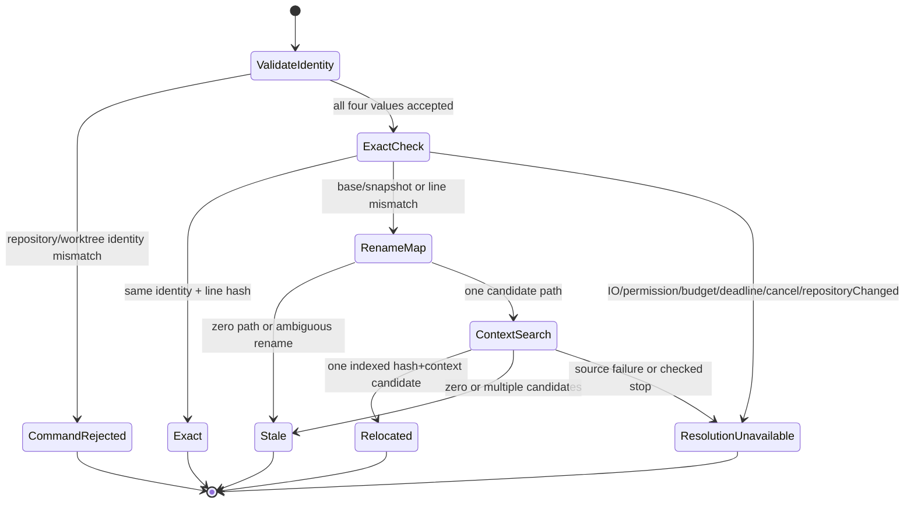

# Issue #198 Specs / Diff comment anchors and review navigation implementation plan

Issue: #198
Epic: #190 Specs / Diff integrated review Phase 1
Dependencies: #191, #194, #197, #201, #202, #203

## Goal

Reuse the existing Review panel for repository Diff comments without changing the existing Spec comment domain, commands, export/MCP behavior, or JSON v2 storage. Repository comments are stored in a separate Git-common-dir JSON v1 document, use optimistic revision CAS for every mutation, and retain their original line anchor while runtime resolution reports `exact`, `relocated`, `stale`, or per-comment `unavailable`.

Users can create one Phase 1 comment per repository line from Unified, Split, or Editor, operate the inline composer with keyboard only, filter Diff comments by Open / Resolved / All, and jump in both directions between line indicators and Review cards. A stale or ambiguous anchor remains visible but never silently jumps to a guessed line.

## Planning inputs and current-state findings

### Authoritative decisions

- Issue #191 ADR is authoritative: Spec comment JSON v2 and Spec commands remain unchanged; Diff comments use a physically separate JSON v1 document under the resolved Git common dir.
- The repository comparison remains `merge-base(base branch, HEAD)` versus the current committed + staged + unstaged + untracked snapshot.
- Missing storage loads as revision `"0"`; first successful mutation writes revision `"1"`; every mutation uses `expectedRevision` CAS and the store computes the next revision.
- Stored anchors are immutable history. Runtime resolution is not serialized.
- Base anchors require `oldPath`; current anchors require `newPath`; added/untracked accept current only; deleted accepts base only; rename/copy retain both paths.
- One line can receive at most one newly-created Diff comment in Phase 1. There are no replies.

### Existing implementation that must be reused

- Rust repository value objects already validate `RepositoryId`, `CommitSha`, `SnapshotId`, and strict UTF-8 `RepositoryRelativePath`.
- `GitRepositoryAdapter` already resolves and boundary-checks the canonical Git dir/common dir and caches snapshot-bound base/change context after `load_repository_diff`.
- `FileReview` already carries old/new content, numbered structured hunks, file status, binary/large/missing states, and rename paths.
- `DiffLine` carries old/new 1-based line numbers. Unified and Split share `projectChangeBlocks`; Editor exposes typed current-line anchors and marks peek/annotation rows non-commentable.
- The existing CommentSidebar already implements Open / Resolved / All, search, selection, resolve/reopen, editing, keyboard list navigation, loading/empty/error states, and `aria-current`.
- Spec comments use `Comment`, `CommentAnchor`, `JsonCommentRepository`, `comments.rs` JSON v2, and the current Spec-only Tauri commands/hooks. These remain the Spec source of truth.

### Gaps to close

- Rust has no Diff comment entity, Diff repository trait, v1 JSON codec/store, CAS mutation result, anchor resolver, or Tauri commands.
- `GitRepositoryAdapter::git_directories` is private and its cached context does not expose a snapshot-bound comment-resolution input through `RepositoryPort`.
- The existing frontend `diffComment.ts`/`decodeDiffAnchor` skeleton is not the accepted ADR shape: paths are nullable in one flat type, context is one string, revision is repeated per comment, and resolution reasons are untyped strings.
- CommentSidebar/CommentThread render Spec anchor fields directly, so a presentation adapter is required before Diff comments can reuse the panel.
- Unified/Split do not expose commentability controls or semantic line target IDs. Editor only exposes the non-commentable/current DOM distinction and has no composer/indicator contract.
- App hides the Review panel in Diff mode and has no worktree-wide Diff comment state or comment-location jump state.
- `WorktreeId` is currently an opaque filesystem-path string and therefore cannot be inserted literally into a filename. The storage adapter needs a filename-safe deterministic storage key.
- The implementation-plan skill references `references/tdd-guidelines.md`, but that file is absent from the installed skill package. This plan uses the available `test-design-patterns.md` plus the repository TDD/testing rules as the test-design source.

## Scope

### In scope

- Separate Rust Diff comment domain types, repository port, use cases, persistence, anchor resolution, command DTOs, and dependency wiring.
- Strict Diff comment JSON v1 in the canonical Git common dir, document revision CAS, cross-process file locking, durable temp write, and atomic replacement.
- `exact`, `relocated`, typed semantic `stale`, and typed operational `unavailable` runtime resolution with original anchor preservation.
- Source-neutral line comment targets for Unified/Split/Editor and one shared commentability policy.
- Hover/focus `+`, one inline composer, `Esc`, `Cmd/Ctrl+Enter`, indicators, Review filter, resolve/reopen/body edit, and bidirectional jump.
- Worktree-wide Diff Review list. Cards include path, side, line, snippet, resolution state, and jump availability.
- Spec-to-Review and Diff-to-Review presentation adapters that preserve Spec JSON v2, command, export, LLM, and MCP contracts.
- Domain, persistence, use-case, IPC decoder, hook, component, App integration, Storybook/play, playwright-cli, performance, and security coverage.
- User/developer documentation for schema, storage, recovery, stale behavior, keyboard use, and Phase 1 limitations.

### Out of scope

- Reply threads or more than one newly-created comment per resolved repository line.
- Persisting runtime resolution or rewriting a stored anchor after relocation.
- Diff comment export, MCP feedback, AI apply, unbounded/global orphan cleanup, document deletion, or worktree-history cleanup. Target-lock-held bounded orphan-temp recovery is the sole cleanup in #198.
- Migrating or unionizing Spec comment JSON v2, Spec commands, Spec domain anchors, or Spec export payloads.
- Arbitrary revision selection, staging/commit/discard actions, syntax highlighting, or editable Editor content.
- Automatic conflict replay. A revision conflict refreshes state and preserves the draft; the user explicitly retries.
- Deleting Diff comments in Phase 1. The shared Review presentation hides that capability for Diff while retaining Spec delete unchanged.

## Design decisions

### 1. Logical Review integration, physical/domain separation

Keep the stored models separate:

```ts
type CommentTarget =
  | Readonly<{ kind: "spec"; anchor: SpecCommentAnchor }>
  | Readonly<{ kind: "diff"; anchor: DiffLineAnchor }>;

type ReviewComment = Readonly<{
  id: string;
  target: CommentTarget;
  body: string;
  status: "open" | "resolved";
  locationLabel: string;
  snippet: string;
  resolutionLabel: string;
  canJump: boolean;
  capabilities: Readonly<{
    editBody: boolean;
    resolve: boolean;
    reopen: boolean;
    delete: boolean;
    export: boolean;
  }>;
}>;
```

`ReviewComment` is a frontend presentation model only. `toSpecReviewComment` adapts the existing Spec `Comment`; `toDiffReviewComment` adapts `ResolvedDiffComment`. CommentSidebar and CommentThread consume the presentation model and callbacks, not either persistence DTO. Spec hooks/commands keep returning the existing Spec `Comment` and all Spec-only capabilities remain enabled.

### 2. Diff anchor is a discriminated domain value

Rust private constructors and TypeScript strict decoders validate structural invariants only: the discriminant/required path pairing, positive safe-integer line representable as `NonZeroU32`, and `candidateCount` representable as `u32`. The create use case, which owns the snapshot `DiffFile`, validates the added/deleted/rename/copy/unchanged status matrix. Restoring historical anchors applies structural validation but does not reject them because the current file status changed.

```ts
type DiffAnchorCommon = Readonly<{
  repositoryId: string;
  worktreeId: string;
  line: number;
  baseSha: string;
  currentSnapshotId: string;
  lineHash: string;
  snippet: string;
  contextBefore: readonly string[];
  contextAfter: readonly string[];
}>;

type DiffLineAnchor =
  | (DiffAnchorCommon & Readonly<{
      side: "base";
      oldPath: string;
      newPath?: string;
    }>)
  | (DiffAnchorCommon & Readonly<{
      side: "current";
      newPath: string;
      oldPath?: string;
    }>);

type DiffAnchorResolution =
  | Readonly<{
      status: "exact";
      selectionPath: string;
      sidePath: string;
      side: "base" | "current";
      line: number;
    }>
  | Readonly<{
      status: "relocated";
      selectionPath: string;
      sidePath: string;
      side: "base" | "current";
      line: number;
    }>
  | Readonly<{
      status: "stale";
      reason:
        | "snapshotChanged"
        | "pathMissing"
        | "ambiguousRename"
        | "contextNotFound"
        | "ambiguousContext"
        | "deleted"
        | "binary"
        | "unsupported";
      candidateCount: number; // decoded as integer 0..u32::MAX
    }>
  | Readonly<{
      status: "unavailable";
      reason:
        | "io"
        | "permission"
        | "budgetExceeded"
        | "cancelled"
        | "repositoryChanged";
      canJump: false;
    }>;

type DiffReviewIdentity = Readonly<{
  repositoryId: string;
  worktreeId: string; // canonical WorktreeStorageId, not a path alias
  baseSha: string;
  currentSnapshotId: string;
}>;

type RepositoryOverviewDisplay = Readonly<{
  displayWorktreeLabel: string; // UI-only; never persisted or used as identity
}>;
```

`DiffReviewIdentity` is emitted by repository overview and is required, unchanged, by all three Diff comment commands. It is also the frontend hook generation key and the backend overview-cache/source lookup key. Every command compares all four identity values (`repositoryId`, canonical `worktreeId`, `baseSha`, `currentSnapshotId`). The overview's display path/label is a separate presentation DTO field and is never persisted, accepted by comment commands, or used as a key. A partial match is a typed identity/snapshot failure, never a cache fallback.

The create command receives that identity, a snapshot-bound line target, and the expected document revision. The backend reloads the exact identity-keyed repository context/file side, validates status/path/line, and derives `lineHash`, snippet, and context. It does not trust frontend-provided hashes or context.

Canonical line hashing is `sha256:` plus 64 lowercase hex characters over the full canonical logical line UTF-8 bytes. The splitter treats LF, CRLF, and lone CR as one delimiter and defines that a terminal delimiter creates no extra logical line. The line text excludes the delimiter. Store at most three context lines before and after. Limit snippet and every context line to the first 256 Unicode scalar values without splitting a scalar; hash the untruncated logical line.

Creation and relocation candidate building call the same canonical splitter/hash/context projector. Stored and candidate snippets/context therefore use identical newline normalization and 256-scalar truncation. Golden vectors cover mixed delimiters, terminal delimiters, empty lines, non-BMP Unicode, and inputs equal through scalar 256 but different afterward, proving full-hash uniqueness and explicit truncated-context collision handling.

### 3. One shared commentability policy across three views

Add a source-neutral `DiffLineCommentTarget` projector under `features/diff/lib/`. It consumes `FileChange`, `DiffLine`, and a visible gutter side and returns either a valid target seed or `null`.

| View/row | Comment target |
|---|---|
| Unified removed old gutter | base / `oldPath` / `oldLineNumber` |
| Unified added new gutter | current / `newPath` / `newLineNumber` |
| Unified context | independent base and current gutter targets when each line number/path exists |
| Split left real cell | base / `oldPath` / `oldLineNumber` |
| Split right real cell | current / `newPath` / `newLineNumber` |
| Editor current line in Changed or All | current / selected repository path / current full-content line number |
| Editor peek/summary/annotation | not commentable |
| hunk header, no-newline annotation, gap, spacer | not commentable |
| binary/large/unsupported/missing side | not commentable |

Added/untracked never produce a base target; deleted never produces a current target. Rename/copy targets retain both old/new paths. Runtime resolution separates `selectionPath` (the current file-tab key to open) from `sidePath` (the immutable old/new anchor path shown to the user); base-side rename/copy navigation opens `selectionPath=newPath` while preserving `sidePath=oldPath`. A location key includes `side + sidePath + line`, so Unified context exposes two deliberate targets. The create action is disabled when the runtime location already has any open or resolved comment.

Unified/Split expose controls only where diff rows exist. Editor exposes current-side controls for every real, text repository-file line, including unchanged files opened from All. For unchanged files the backend loads full current content and validates the positive line independently of hunks; it does not require a `FileChange`. Binary/large/missing/unsupported and synthetic peek/annotation rows remain non-commentable. Bare repositories retain the existing typed rejection contract and fixture.

Historical anchors may converge on one relocated line after later edits. They are never deleted or merged. A converged indicator shows the total count, opens a stable picker ordered by `createdAt` then comment ID, and keeps active indicator/card state synchronized when choosing among cards. The backend rejects creation of another comment at a location already occupied by an exact/relocated comment. Resolving a comment does not release occupancy; only update/reopen is available for that line.

### 4. Stored document and CAS contract

The persisted document contains only stored comments:

```json
{
  "version": 1,
  "revision": "7",
  "repositoryId": "rr1_...",
  "worktreeId": "wt1_...",
  "comments": [
    {
      "id": "cmt_...",
      "body": "Null caseを明示してください",
      "resolved": false,
      "createdAt": "2026-08-11T00:00:00Z",
      "anchor": {
        "repositoryId": "rr1_...",
        "worktreeId": "wt1_...",
        "side": "current",
        "oldPath": "src/parser.ts",
        "newPath": "src/parser.ts",
        "line": 42,
        "baseSha": "0123456789abcdef0123456789abcdef01234567",
        "currentSnapshotId": "rs1_...",
        "lineHash": "sha256:...",
        "snippet": "return parse(value);",
        "contextBefore": ["if (value == null) {"],
        "contextAfter": ["}"]
      }
    }
  ]
}
```

- Persist exactly ADR v1 fields: document identity/revision and comments containing immutable anchor, `body`, `resolved: boolean`, and `createdAt`. `status` is a runtime Review projection; `updatedAt` is not introduced.
- `#[serde(deny_unknown_fields)]` remains defense in depth, but serde alone does not detect duplicate object keys. Decode through a bounded custom map visitor that rejects duplicate keys at every v1 object level before constructing typed DTOs. Separate structural invariants (schema, duplicate keys/IDs, canonical fields) from status/side semantic invariants and return stable error codes.
- Reject malformed JSON, unknown version, invalid timestamps, duplicate IDs/keys, unknown/retired fields, non-canonical revision, identity mismatch, invalid path/side/line/hash, and limit violations. Never reinterpret invalid data as an empty list.
- Envelope `repositoryId`/`worktreeId` must match every anchor. Display paths/labels, `storageFileKey`, `status`, `updatedAt`, and `anchorResolution` are rejected in storage and never serialized.
- IPC and JSON revisions are 1–20 ASCII decimal digits matching `^(0|[1-9][0-9]{0,19})$`, parsed with checked `u64`; values above `18446744073709551615` are rejected.
- Missing file loads as revision 0. Mutation succeeds only when `expectedRevision == currentRevision`; the locked store uses `checked_add(1)`. Mismatch returns `conflict` plus the latest **stored** revision/document even when its runtime resolution is unavailable. Overflow returns `preCommitFailure { code: "revisionOverflow", currentDocument, currentRevision, retryable: false }` and writes nothing.
- The persistence commit point is successful atomic replacement of the destination. Mutation outcome is an explicit union:

```ts
type DiffCommentMutationOutcome =
  | Readonly<{
      kind: "committed";
      document: ResolvedDiffComments;
      revision: string;
      resolutionWarnings: readonly ResolutionWarning[];
      durability: "durable" | "uncertain";
    }>
  | Readonly<{
      kind: "conflict";
      latestDocument: ResolvedDiffComments;
      latestRevision: string;
      resolutionWarnings: readonly ResolutionWarning[];
    }>
  | Readonly<{
      kind: "preCommitFailure";
      code: "revisionOverflow";
      currentDocument: ResolvedDiffComments;
      currentRevision: string;
      retryable: false;
    }>
  | Readonly<{
      kind: "preCommitFailure";
      code: "storeBusy" | "io";
      retryable: true;
    }>
  | Readonly<{
      kind: "preCommitFailure";
      code: "permission" | "invalidStore";
      retryable: false;
    }>;
```

- Every result after atomic replacement is `committed`. Resolution failure returns the committed document/revision plus warnings; post-replace durability confirmation failure sets `durability: "uncertain"`. Neither is retryable because replay could duplicate a committed mutation. `conflict` and `preCommitFailure` are explicitly not committed. Revision overflow is its own non-retryable pre-commit variant with the canonical current document/revision: submit stays disabled; the controlled textarea body remains selectable/copyable; no Diff export capability. Transient `storeBusy`/`io` and permanent `permission`/`invalidStore` are separated by the literal `retryable` discriminant and the strict decoder rejects inconsistent code/flag pairs.
- Spec v2 strict-read behavior is not changed. Golden tests additionally prove unknown Spec v2 extension fields survive the existing read-update-write path byte/semantic contract expected by that codec.

### 5. Safe Git-common-dir storage

ADR wire/storage field name remains `worktreeId`; its value is the canonical `WorktreeStorageId` generated from a versioned domain tag plus length-framed raw platform bytes for canonical common dir and canonical per-worktree Git dir. UI display path/label is separate and not persisted. The persistence adapter derives an internal `storageFileKey = sha256(length_frame(worktreeId UTF-8 bytes))`:

```text
<git-common-dir>/spec-viewer/diff-comments/df1_<storageFileKey>.v1.json
<git-common-dir>/spec-viewer/diff-comments/df1_<storageFileKey>.lock
```

The adapter key is not part of wire/domain/storage JSON. Distinct repositories, linked-worktree Git dirs, and path aliases cannot collide by concatenation or aliasing. Recreating the **same canonical common-dir + worktree-Git-dir identity** explicitly reattaches its `worktreeId` history; a different repository or canonical identity receives a different ID. Worktree-history cleanup remains Phase 2.

Extract the existing canonical Git dir/common-dir logic into `infrastructure/git/common_dir.rs` so repository reads and comment storage share one boundary implementation. Threat boundary: Git-discovered canonical common dir is trusted input, but require the canonical common dir and generated store root to be real directories, not symlinks/reparse points, before use. All storage leaf components are fixed literals or program-generated IDs/nonces; repository anchor paths never participate in storage paths. Do not claim protection from an already-compromised trusted Git metadata owner or stronger race-free path containment than these checks provide.

Toolchain decision: set `rust-version = "1.89"` and use stabilized `std::fs::File::try_lock`/`unlock` for the non-deleted sibling lock file; no lock crate is added. `LOCK_TIMEOUT_MS = 2_000` with capped 25 ms backoff returns typed `storeBusy`; the lock file is never deleted. Add target-specific `windows-sys 0.61` with only Foundation/FileSystem features.

The exclusive lock covers read/check/increment/write/replace. Orphan-temp scanning is permitted recovery hygiene. Deletion occurs only after target-lock acquisition and revalidation of generated prefix/ownership/scope, `ORPHAN_MIN_AGE_HOURS = 24`, `MAX_ORPHAN_SCAN = 128`, and `MAX_ORPHAN_DELETE = 32`; never delete lock/document/fresh/unknown files. Create user-only permissions where supported. Under the lock:

1. Open/read the current document with a fixed 8 MiB maximum.
2. Strict-decode and check expected revision.
3. Serialize the next document with bounded comments/body/context.
4. Create a unique same-directory temp file with `create_new` and no symlink following.
5. Write all bytes and `sync_all`, then call a `PlatformAtomicReplace` abstraction. Unix uses same-directory `rename` followed by directory `fsync`. Windows uses `MoveFileExW(MOVEFILE_REPLACE_EXISTING | MOVEFILE_WRITE_THROUGH)` only when the destination is confirmed absent. Existing destinations use `ReplaceFileW`; no generic MoveFileEx fallback is allowed. Only `ERROR_FILE_NOT_FOUND` or `ERROR_PATH_NOT_FOUND` permits a re-probe, and MoveFileEx is used only if that re-probe confirms first-create. Access/sharing/merge/other errors are `preCommitFailure`.
6. Before replacement failure, the old destination remains intact and revision is uncommitted. Successful replacement is the CAS commit point. A later durability confirmation failure returns `committed { durability: "uncertain" }`.
7. Clean the current temp on every pre-commit failure; leave enough typed diagnostic state for safe orphan cleanup after process kill.

### 6. Exact, relocated, stale, and unavailable resolution

Resolution receives the exact `DiffReviewIdentity` from `RepositoryOverview` and uses only the four-value-keyed snapshot context. Stored comments are always returned. Process them in deterministic `sidePath, side, commentId` order under these per-load ceilings:

- `MAX_RESOLUTION_COMMENTS = 10_000`
- `MAX_UNIQUE_FILES = 10_000`
- `MAX_UNIQUE_SIDE_SOURCES = 20_000` (derived base/current ceiling)
- `MAX_LOADED_SOURCE_BYTES = 64 MiB`
- `MAX_LOADED_LOGICAL_LINES = 2_000_000`
- `MAX_GIT_FILE_LOADS = 2_048`

Group by candidate file, load each side once, and build one hash-to-line index per `(side,path,snapshot)`. Inject a monotonic clock, `RESOLUTION_TOTAL_DEADLINE_MS = 200`, and a `CancellationToken`; check deadline/cancellation immediately before and after every external Git/cache/source load and before each index build. Once the next source/comment exceeds a structural ceiling or the total deadline, affected and later deterministic entries return per-comment `unavailable { reason: "budgetExceeded", canJump: false }`. Once cancelled, the remaining deterministic suffix returns `unavailable { reason: "cancelled", canJump: false }`. No stored comment is omitted and no external load starts after either condition is observed.

1. **Exact**: repository/worktree/base/snapshot identities match, required side path exists, stored line is in range, and full line hash matches.
2. **Relocation candidate paths**: retain the stored side path first; then apply only a unique rename/copy mapping that preserves old/new identity. Multiple mappings return `ambiguousRename`.
3. **Unique context search**: build candidate hashes/snippets/context with the same canonical newline and 256-scalar projector as creation. Find lines with the same full line hash, then narrow with bounded exact `contextBefore`/`contextAfter`. One candidate is `relocated`; zero is `contextNotFound`; multiple—including equal truncated context with differing text after scalar 256 when full hashes do not disambiguate—are `ambiguousContext`. Do not use nearest-line or fuzzy selection.
4. **Result boundary**: semantic anchor failures (missing path, deleted side, binary/large/unsupported content, no candidate, ambiguity) return typed `stale` with no jump target. Each repository/Git/read/cache IO, permission, budget, cancellation, or mid-resolution repository-change failure returns a per-comment `unavailable { reason, canJump: false }`; it is runtime-only and never persisted. `ResolvedDiffComments` carries these entries in both committed and conflict outcomes. `resolutionWarnings` is only a deduplicated load-level/UI summary derived from unavailable entries (plus durability warnings), never a second source of comment status. The Review projection shows the unavailable reason, a non-jump warning action/state, and preserves the stored comment.

`baseSha`/`currentSnapshotId` mismatch within the same repository/worktree identity triggers relocation rather than rewriting the anchor. A repository/worktree identity change rejects the command rather than searching another history. A deleted file remains resolvable on base only if old text is available; a current anchor to a deleted file is stale `deleted`.

### 7. Mutation and frontend conflict state

Commands are additive and Diff-specific:

- `load_diff_comments({ identity })`
- `save_diff_comment({ identity, expectedRevision, target, body })`
- `update_diff_comment({ identity, expectedRevision, commentId, body?, resolved? })`

`update_diff_comment` requires at least one of `body` or `resolved`; empty bodies are rejected. It covers body edit, resolve, and reopen. Delete is not exposed in Phase 1.

`useDiffComments` owns `{revision, comments, resolutionWarnings}`, controlled filter/search/selection, controlled drafts, and the mutation outcome union. Sessions are keyed by full four-value `DiffReviewIdentity`; draft/edit/mutation origins additionally include immutable anchor target or comment ID.

- On full identity change, old comments disappear synchronously. An unsent draft keeps its body but becomes `staleTarget`: hidden from the new identity, submit disabled, and only explicit re-anchor or discard is allowed. Base/snapshot refresh is an identity change.
- Tab/mode changes within one identity only hide incompatible drafts. Returning restores them; a base draft hidden in Editor returns in Unified.
- A mutation settles its origin session, never whichever identity is visible. Save in A → switch B → completion updates A only; returning A shows the result.
- `committed` reconciles origin document/revision, disables submit, closes the matching draft, and shows warning/durability state without retry. `conflict` replaces origin latest and preserves draft/body/focus for explicit retry. Every `preCommitFailure` preserves draft/body/focus. Transient `storeBusy`/`io` enables explicit retry; permanent `permission`/`invalidStore` disables submit until the environment changes; `revisionOverflow` reconciles the supplied current document/revision and permanently disables submit for that identity; the controlled textarea body remains selectable/copyable; no Diff export capability.
- The hook never increments revisions locally or automatically replays a mutation.

### 8. Inline composer, indicators, and accessibility

- Hovering or focusing a commentable gutter reveals a real `button` labelled with path, side, and line. Color is not the only cue.
- Only one inline composer is open in the repository workspace. The textarea is focused on open; non-composing `Esc` calls `stopPropagation`, cancels, keeps the Review panel open, and restores focus to the originating `+`. `Cmd+Enter` / `Ctrl+Enter` submits only when `isComposing=false`; plain Enter inserts a newline and IME composition keys are ignored.
- Empty/whitespace bodies are rejected inline. Saving disables duplicate submission and exposes polite status; errors/conflicts use an alert without discarding text.
- Existing comments render a count/indicator button. Activating it selects the corresponding Review card; when historical comments converge, the indicator exposes the count and selection menu/order deterministically.
- Editor, Unified, and Split composer rows all participate in mixed-height measurement and anchor-preserving windowing. Folded context containing a composer/target expands deterministically. Opening/closing a composer preserves the semantic scroll anchor; 20k-line views remain under the existing DOM cap, including peek + composer rows.
- Stale cards display reason and original location, `canJump=false`, and no enabled jump control.
- `aria-label`, `aria-expanded`, `aria-controls`, `aria-current`, focus rings, and live conflict/save status are verified. Gutter controls do not steal file-tab, change-navigation, or grid shortcuts.

### 9. Bidirectional jump and view behavior

Diff Review is worktree-wide. Selecting a jumpable card:

1. opens/selects its resolved path tab;
2. preserves the active Unified/Split/Editor mode when that mode can display the side;
3. changes Editor to Unified for a base-side target because Editor cannot display base lines;
4. expands a folded Unified/Split context gap or materializes the Editor window;
5. scrolls and focuses the semantic line target, then marks the card/indicator active.

CommentSidebar is controlled: parent state owns status filter, search, and selection. Line indicator activation sets filter to `all`, clears search, selects/materializes/focuses the card, and applies `aria-current`; it does not lose the composer draft. Card-to-line navigation preserves the user's filter/search.

Add a tree-independent `openRepositoryPath(selectionPath)` API and a separate path-scoped comment jump target; do not overload change IDs or require the path to remain visible in the current tree filter. A comment jump opens a Changed-file tab even when Changed/All tree filters hide it and preserves the tree filter. Runtime navigation uses `selectionPath` to open the tab and `sidePath` for anchor identity/labels. Refresh keeps the stored target identity but reconciles it against the new resolution. View switches reuse resolved `{side,selectionPath,sidePath,line}` and never derive identity from a DOM row index.

## System diagrams

### State machine

```mermaid
stateDiagram-v2
  [*] --> Idle: Diff mode or worktree unavailable
  Idle --> Loading: complete DiffReviewIdentity ready
  Loading --> Ready: stored revision + resolution accepted
  Loading --> ReadyWithWarnings: comments preserved + resolution warnings
  Loading --> StoreError: malformed/schema/path/read failure
  Ready --> Composing: commentable gutter +
  Composing --> Ready: non-IME Esc + restore focus
  Composing --> Saving: Cmd/Ctrl+Enter + valid body + not composing
  Saving --> Committed: atomic replace commit point
  Committed --> Ready: settle origin + close draft + durable
  Committed --> ReadyWithWarnings: settle origin + close draft + warnings/uncertain
  Saving --> Conflict: expectedRevision mismatch
  Conflict --> Composing: origin latest + draft/focus preserved
  Conflict --> Saving: explicit retry with latest revision
  Saving --> RetryableFailure: storeBusy/io + retryable true
  RetryableFailure --> Composing: draft/focus preserved + explicit retry
  Saving --> PermanentFailure: permission/invalidStore + retryable false
  PermanentFailure --> Composing: draft preserved; submit disabled until environment changes
  Saving --> RevisionOverflow: current document/revision + retryable false
  RevisionOverflow --> Composing: submit disabled; controlled textarea body remains selectable/copyable; no Diff export capability
  Ready --> Ready: Open/Resolved/All filter or card/line selection
  Ready --> Idle: identity switch clears old comments
  Composing --> StaleTarget: full identity changes
  StaleTarget --> Composing: explicit re-anchor
  StaleTarget --> Idle: discard
  Composing --> DraftHidden: tab/mode cannot show target
  DraftHidden --> Composing: compatible mode returns
  Idle --> Loading: load new four-value identity
  Ready --> Ready: exact/relocated jump
  ReadyWithWarnings --> UnavailableSelected: unavailable card selected
  UnavailableSelected --> ReadyWithWarnings: warning shown; jump disabled
  Ready --> StaleSelected: stale card selected
  StaleSelected --> Ready: select another card
  ReadyWithWarnings --> Loading: refresh resolution only
  StoreError --> Loading: retry
```



Anchor resolution is a nested deterministic state machine:



### Data flow

```mermaid
flowchart LR
  O[Repository overview identity + display label] -->|identity only| H[full-identity sessions]
  O -->|same identity| P[Tauri diff_comments commands]
  UI[Unified / Split / Editor measured line target] --> C[Controlled inline composer]
  C --> G[diffComments IPC gateway + strict decoder]
  G -->|origin identity/target + CAS| P
  P --> U[DiffCommentUseCases]
  U -->|four-value key| RP[RepositoryPort snapshot-bound source]
  RP --> GA[GitRepositoryAdapter]
  U --> DR[DiffCommentRepository]
  DR --> ID[worktreeId to internal storageFileKey]
  ID --> LK[Persistent cross-process lock]
  LK --> J[Strict Diff JSON v1 + CAS]
  J --> AR[PlatformAtomicReplace commit point]
  AR -->|committed or preCommitFailure| DR
  CT[Monotonic deadline + CancellationToken] --> R
  GA --> IX[Checked external loads + per-side hash index]
  IX --> R[Exact / relocated / stale / per-comment unavailable]
  DR --> R
  R -->|all comments + derived warning summary| P
  P -->|committed / conflict / preCommitFailure| G
  G -->|settle origin session even when hidden| H
  H --> ST[staleTarget re-anchor or discard]
  H --> A[toDiffReviewComment adapter]
  S[Existing Spec comments v2 + commands] --> SA[toSpecReviewComment adapter]
  A --> V[Shared Review panel]
  SA --> V
  V --> N[Controlled filter/search/selection]
  N --> OP[tree-independent open selectionPath]
  OP --> UI
  UI -->|indicator: All + clear search + focus card| N

  style J fill:#ffe4b5,stroke:#d97706,stroke-width:2px
  style AR fill:#ffe4b5,stroke:#d97706,stroke-width:2px
  style R fill:#ffe4b5,stroke:#d97706,stroke-width:2px
  style A fill:#ffe4b5,stroke:#d97706,stroke-width:2px
```



## Folder structure

### Current relevant structure

```text
src-tauri/src/
├── domain/comment/{mod.rs,repository.rs}          # Spec comment domain
├── domain/repository/mod.rs                       # repository IDs, paths, FileReview, port
├── app/use_cases/comments.rs                      # Spec comment use cases
├── infrastructure/git/repository.rs               # private common-dir + snapshot context
├── infrastructure/persistence/comments.rs         # Spec JSON v2
├── infrastructure/persistence/comment_store.rs    # Spec store
└── presentation/commands/comments.rs              # Spec commands

src/
├── features/comments/                             # Spec comment domain/hooks/shared UI
├── features/repositoryDiff/domain/diffComment.ts  # incomplete #202 skeleton
├── features/diff/components/{DiffViewer,CurrentFileViewer}/
├── lib/api/tauri/repositoryDiff*.ts
└── app/App/index.tsx                              # Review panel shown only in Specs
```

### Planned structure

```text
src-tauri/src/
├── domain/comment/
│   ├── mod.rs
│   ├── diff.rs
│   └── diff_repository.rs
├── domain/repository/mod.rs
├── app/use_cases/diff_comments.rs
├── infrastructure/git/
│   ├── common_dir.rs
│   ├── mod.rs
│   └── repository.rs
├── infrastructure/persistence/
│   ├── diff_comment_json.rs
│   ├── diff_comment_paths.rs
│   ├── diff_comment_store.rs
│   ├── atomic_replace.rs
│   └── mod.rs
├── presentation/commands/
│   ├── diff_comments.rs
│   └── mod.rs
└── lib.rs

src/
├── components/WorkspaceLayout/
├── features/comments/
│   ├── domain/reviewComment/
│   └── components/{CommentSidebar,CommentThread}/
├── features/diff/
│   ├── domain/lineComment/
│   ├── lib/diffLineCommentTarget/
│   └── components/{DiffViewer,CurrentFileViewer,DiffCommentComposer}/
├── features/repositoryDiff/
│   ├── domain/diffComment.ts
│   ├── lib/reviewCommentProjection/
│   ├── hooks/{useDiffComments,useDiffCommentNavigation}/
│   └── components/DiffViewCommentSidebar/
├── lib/api/tauri/
│   ├── diffComments.ts
│   ├── diffCommentDecoder.ts
│   └── index.ts
├── utils/uiText/index.ts
└── app/App/{index.tsx,App.stories.tsx,__tests__/}

e2e/repository-diff-comments.spec.ts
playwright.config.ts
package.json
.github/workflows/{frontend,backend}.yml
```

## Major Rust components

### Diff comment domain and repository contract

- `DiffReviewIdentity`, `DiffLineAnchor`, `DiffAnchorTarget`, `StoredDiffComment`, `StoredDiffCommentDocument`, `ResolvedDiffComment`, `ResolvedDiffComments`, four-way `DiffAnchorResolution`, deduplicated `ResolutionWarning`, `StaleAnchorReason`, `UnavailableReason`, `DiffCommentRevision`, `CancellationToken`, monotonic `ResolutionClock`, and typed domain errors.
- Constructors/decoders enforce structural discriminant/path, `NonZeroU32` line, `u32` candidate count, bounded hash/context, and complete identity. Create-use-case validation owns current DiffFile status/full-content rules; historical restore stays structural. Stored comments have only `resolved` and `created_at`.
- `DiffCommentRepository::load` returns revision 0 for missing storage. `mutate` returns `committed | conflict | pre_commit_failure`; committed includes document/revision/warnings/durability independently of visible UI or resolution success.
- Duplicate ID and duplicate target creation are domain/repository errors, not silent replacements.

### Snapshot-bound anchor source

Extend `RepositoryOverview` with canonical `worktreeId` identity plus a separate display label, and `RepositoryPort` with a complete-identity source method. It returns diff old/new sources when present and full current text for unchanged All files. `GitRepositoryAdapter` keys by all four values, preserves bare rejection, and separates structural/status validation, semantic stale, unavailable IO, and budget outcomes.

The anchor resolver caches `DiffCommentFileSource` and one hash-to-line index per side/path/snapshot for a load call. Its injectable monotonic clock/deadline and `CancellationToken` are checked around every external load and index build. It does not expose filesystem paths or Git commands to domain code.

### Diff comment use cases

- `load`: strict-load the stored revision, then resolve comments; resolution failure returns that revision with typed warnings/unavailable entries.
- `save`: validate identity and snapshot DiffFile/full current content (including unchanged), derive anchor, reject occupancy including resolved, CAS commit, then resolve without changing outcome.
- `update`: preserve original anchor/creation time, CAS-update only body/resolved, commit, then resolve without changing commit outcome.
- Atomic replace always returns `committed`; conflict/preCommitFailure never do. Durability uncertainty and resolution warnings remain committed and non-retryable. Overflow returns the canonical current document/revision as non-retryable; other pre-commit codes carry a decoder-enforced literal retryability.

### Presentation DTOs

Request DTOs require complete identity and strict checked revision, safe-integer/`NonZeroU32` line, body and ID. Runtime decoder checks `candidateCount <= u32::MAX`, every unavailable reason with `canJump: false`, and exact mutation code/retryable/current-document requirements. Responses expose the mutation union and keep per-comment runtime resolution authoritative; warning summaries and committed durability are separate presentation data.

## Concrete file changes

### Rust / Tauri

- Add `src-tauri/src/domain/comment/diff.rs` and `diff_repository.rs`; export them from `domain/comment/mod.rs`.
- Update `src-tauri/src/domain/repository/mod.rs` and overview DTO mapping with `DiffReviewIdentity` plus the narrow four-value-keyed source/port method.
- Add `src-tauri/src/app/use_cases/diff_comments.rs` with resolver deadline/cancellation orchestration; export outcome, clock, cancellation, and error types from `app/use_cases/mod.rs`.
- Add `src-tauri/src/infrastructure/git/common_dir.rs`; update Git repository/overview DTOs with canonical `worktreeId`, separate display label, full-current unchanged source, cache keys, and bare fixture.
- Add `src-tauri/src/infrastructure/persistence/{diff_comment_json,diff_comment_paths,diff_comment_store,atomic_replace}.rs` and integration tests for internal `storageFileKey`, lock-scoped temp recovery, structural budgets/counters, drop/recreate restart, isolation, kill points, and Windows error allowlist.
- Add `src-tauri/src/presentation/commands/diff_comments.rs`; update command `mod.rs`, `CommandState`, and `src-tauri/src/lib.rs` registration.
- Update `src-tauri/Cargo.toml`/`Cargo.lock`: set `rust-version = "1.89"`; add target-Windows `windows-sys = "0.61"` Foundation/FileSystem features; do not add a lock crate.
- Update `.github/workflows/backend.yml` with a Windows store test job covering atomic replace, child-process contention, and kill-point recovery.

### Frontend domain / IPC / state

- Replace `diffComment.ts` with ADR `worktreeId`, separate overview display, structural bounds, exact/relocated/stale/unavailable runtime types, retryability-discriminated committed/conflict/preCommitFailure outcomes, and origin/staleTarget session types.
- Update repository overview types/decoder/tests to require `DiffReviewIdentity` and reject any missing/mismatched identity component.
- Update/remove the duplicate anchor skeleton in `src/lib/api/tauri/repositoryDiffDecoder.ts`; place Diff comment decoding in new `diffCommentDecoder.ts` and keep repository file decoding focused.
- Add `src/lib/api/tauri/diffComments.ts` and exports/tests for three commands, strict result decoding, canonical revision, and error normalization.
- Add `useDiffComments/` and navigation hooks with full-identity sessions, identity+target origins, staleTarget re-anchor/discard, mode hide/restore, origin settlement, committed no-retry, conflict retry, overflow submit-disabled state where the controlled textarea body remains selectable/copyable and there is no Diff export capability, code-gated pre-commit retry, cancellation on superseded loads, and switch guards.

### Shared Review presentation

- Add `src/features/comments/domain/reviewComment/` with `CommentTarget`, ReviewComment, capabilities, and adapter-neutral list state.
- Refactor `src/features/comments/components/CommentSidebar/{index.tsx,__tests__,CommentSidebar.stories.tsx}` and `CommentThread/{index.tsx,stories/tests}` to controlled filter/search/selection and ReviewComment display fields/capabilities.
- Update `SpecViewCommentSidebar` to adapt existing Spec comments without changing Spec hooks, commands, export/MCP, filters, or delete.
- Add `DiffViewCommentSidebar` and `reviewCommentProjection` for path/side/line/stale/unavailable labels, unavailable non-jump warnings, and disabled Phase 1 capabilities.
- Update `src/components/WorkspaceLayout/{index.tsx,__tests__,WorkspaceLayout.stories.tsx}` for Diff Review panel persistence and `src/utils/uiText/index.ts` for accessible/status/error copy.

### Viewer and App integration

- Add source-neutral `lineComment` types, `diffLineCommentTarget`, and `DiffCommentComposer`.
- Update `diffViewModel` row/cell metadata to retain semantic old/new targets, measured heights, and scroll anchors through folding/windowing.
- Update `DiffViewer/{index.tsx,__tests__,DiffViewer.stories.tsx}` with Unified/Split gutter controls, indicators, mixed-height/window measurements, folded-target materialization, composer, focus, and 20k DOM-cap tests.
- Update `CurrentFileViewer` with current controls for Changed and unchanged All full-content lines, mixed-height tests/stories, and non-commentable peek.
- Extend `repositoryDiffNavigationState` and hook tests with tree-independent `openRepositoryPath(selectionPath)` and a sidePath-aware comment target separate from change IDs.
- Update `src/app/App/{index.tsx,App.stories.tsx,__tests__/App.state.test.tsx}` with identity/origin/staleTarget wiring, convergence picker, All unchanged persistence/jump, and a stateful E2E harness; keep App composition-only.
- Update repository Diff CSS/theme tokens and shared comment panel styles without changing generated output.

### Automated browser E2E and CI

- Add `@playwright/test`, `@axe-core/playwright`, `playwright.config.ts`, `e2e/{repository-diff-comments.spec.ts,support/statefulTauriInvokeMock.ts}`, and `pnpm test:e2e`.
- The stateful App harness renders production App composition and uses production `useDiffComments`, IPC gateway, and strict decoder. Only Tauri `invoke` is replaced with a stateful boundary mock; tests may not substitute the hook/decoder or inject projected comments.
- Browser CI runs create/filter/jump/tab/mode/refresh/conflict plus save → browser reload → same worktree/base/file/card/jump restoration and a second-worktree non-mixing assertion.
- Keep Storybook play tests as component interaction evidence, but do not treat manual `playwright-cli` checks as the automated merge gate.

Responsibility split: Rust temp-repository integration tests prove actual Git-common-dir storage, service/store drop-and-recreate process-restart semantics, worktree isolation, locks/CAS/atomicity, and strict JSON. Browser E2E proves production frontend state/gateway/decoder rehydration and navigation across reload using only the stateful invoke boundary mock. Neither substitutes for the other.

### Documentation

- Update `docs/repository-diff-workspace.md` with commentability by view, keyboard composer, filters, jump/stale/unavailable behavior, transient/permanent/overflow recovery, storage location, and Phase 1 limits.
- Update `docs/design/repository-diff-contract.md` with Diff v1 schema, storage-key realization, discriminated mutation errors, four-way runtime anchor resolution, deadline/cancellation contracts, and Spec v2 non-regression.
- Update `README.md` only if a top-level Review guide link/summary is needed.

## TDD implementation phases

1. **Phase 1 — Domain Red/Green/Refactor**
   - Red: ADR `worktreeId`, display/key non-persistence, structural safe-integer/`NonZeroU32`/u32 boundaries, create status matrix, historical restore, newline/scalar context, and mutation union.
   - Green: minimal immutable domain types and strict decoders.
   - Refactor: remove/replace the incomplete flat frontend anchor skeleton.
2. **Phase 2 — Git common dir and v1 persistence**
   - Red: worktreeId/storageFileKey vectors, drop/recreate restart/isolation, trusted roots, duplicate keys, CAS, persistent lock/storeBusy, lock-scoped bounded temp cleanup, permissions, and Unix/Windows allowlist/kill points.
   - Green: canonical worktreeId, adapter-only file key, strict codec, std lock/CAS, platform atomic replace, outcome union, and restart recovery.
   - Refactor: share bounded primitives while retaining Spec v2 golden unknown-field behavior.
3. **Phase 3 — Anchor creation and resolution**
   - Red: identity mismatch, bare reject, status matrix plus unchanged All full-current line, canonical candidate >256 collision, deterministic budgets, exact/move/convergence, per-comment stale/unavailable, fake-clock slow source, mid-load cancellation, and occupancy.
   - Green: identity-bound diff/full source, backend derivation, one per-side index, injectable monotonic deadline/CancellationToken, and exact/relocated/stale/unavailable resolver.
   - Refactor: isolate pure candidate selection and stop-policy checks from Git adapter orchestration.
4. **Phase 4 — Tauri commands and frontend gateway**
   - Red: strict line/candidate/unavailable bounds and outcome fixtures, committed warning/durability non-retry, conflict latest, retryability code pairs, overflow current-document non-retry, and sanitized errors.
   - Green: three commands, wiring, gateway, strict decoder.
   - Refactor: keep repository and Diff comment decoders focused and remove duplication.
5. **Phase 5 — Diff comment hook and Review projection**
   - Red: full-identity/target origin, A→B→A settlement, base/snapshot staleTarget, re-anchor/discard, mode hide/restore, committed close/no-retry, conflict/precommit retention, overflow submit-disable where the controlled textarea body remains selectable/copyable and there is no Diff export capability, unavailable non-jump projection, controlled list, and Spec regression.
   - Green: origin-aware `useDiffComments`, session store, projection adapters, and controlled Review state.
   - Refactor: preserve Spec CommentSidebar behavior through contract tests.
6. **Phase 6 — Unified/Split/Editor composer and indicators**
   - Red: Changed diff rows + All unchanged Editor matrix, focus/IME/Esc, resolved occupancy, convergence picker, and three-view mixed-height/fold/peek/20k DOM cap.
   - Green: source-neutral target policy, controlled composer, controls, indicators, and three-view measurement.
   - Refactor: one shared policy/helper; no view-local side/path inference.
7. **Phase 7 — Bidirectional navigation and App integration**
   - Red: indicator forces All/clears search/focus/aria-current, card preserves filters, rename/copy selectionPath vs sidePath, tree-filter-independent tab open, base from Editor, folded/windowed materialization, refresh stale, and stale no-jump.
   - Green: controlled navigation state, tree-independent open API, coordinator, and persistent Diff Review panel.
   - Refactor: keep App composition-only and keep comment location separate from change navigation.
8. **Phase 8 — Stories, playwright, docs, and quality gates**
   - Add stateful production App E2E/invoke mock with full journey and reload/worktree isolation, Storybook play, keyboard/IME/axe/themes, and manual visual verification.
   - Add 10k structural budget/counter gates, fake-clock slow-load/deadline/cancellation gates, auxiliary benchmark artifact, Rust restart/Windows child/kill-point CI, security assertions, and contract docs.
   - Run independent TypeScript code and performance reviews before publish.

## Test design matrix

The feature is Pure Logic + Data Transformation + State Management + API Integration + Async Operations + UI Component + DOM Manipulation + filesystem security. TDD is mandatory for domain, persistence, resolution, state, and target projection.

### Rust domain and resolution tests

Role: prove immutable anchor/comment invariants and deterministic resolution without filesystem/JSON details.

| Category | Test case | Scenario | Expected |
|---|---|---|---|
| Structural | anchor decode/constructor | side/required path; line 0, 1, u32 max, u32+1, unsafe JS integer | structural-only acceptance; `NonZeroU32` |
| Create semantic | status matrix | added/deleted/rename/copy/modified/unchanged × side/path | snapshot use case accepts only valid current status/content |
| Restore | historical status drift | structurally valid anchor no longer matches current status | restored, then stale/relocated; not schema-rejected |
| Boundary | context/hash normalization | LF/CRLF/lone CR/terminal delimiter/empty/non-BMP/255–257 scalars | stable full-line hash; scalar-safe truncation |
| Boundary | stored/candidate suffix | equal first 256 scalars, unique/duplicate full hashes | identical projection; unique relocate or explicit ambiguous |
| Identity | four-value identity | each single field mismatched; raw display alias changed | mismatch rejected; alias never keys storage |
| Normal | exact identity/hash | same base/snapshot/path/line | exact location |
| Variation | line/file relocation | unique rename/copy and unique hash+context | relocated selectionPath + immutable sidePath |
| Edge | duplicate line text | 0/2+ candidates | stale contextNotFound/ambiguousContext |
| Edge | multiple rename candidates | ambiguous mapping | stale ambiguousRename |
| Semantic | deleted/binary/unsupported/path missing | content semantically unavailable | typed stale, no target |
| IO | Git/read/cache/permission/repository change | one source cannot be loaded safely | affected comment unavailable with exact reason/canJump false; summary derived; not stale |
| Deadline | fake monotonic clock + slow source | deadline crosses before/after external load or index build | deterministic remaining suffix budgetExceeded; all comments returned; no later external load |
| Cancellation | token cancelled before/during load | cancellation observed at each check point | deterministic remaining suffix cancelled; all comments returned; no later external load |
| Scope | Changed/All/bare | changed diff row, unchanged All full-content line, bare repo | both repository-file cases accepted; bare typed reject |
| Budget | deterministic ceiling | 10k comments small fixture; bytes/lines/Git ops max+1 | all stored returned; overflow suffix unavailable budgetExceeded |
| Index | build count | many comments share side/path | exactly one hash-index build per side source |
| State | occupied runtime location | second create after open/resolved relocation | lineAlreadyCommented |

### Diff JSON v1 and store tests

Role: prove schema isolation, worktree isolation, CAS, locking, and crash-safe replacement.

| Category | Test case | Scenario | Expected |
|---|---|---|---|
| Normal | strict round trip | `resolved` + createdAt only | ADR fields preserved; status/updatedAt/resolution absent |
| Boundary | revision strings | 0, 1, 20-digit u64 max, 21 digits, negative, leading zero, non-digit, overflow | checked canonical u64 only |
| Error | duplicate key visitor | duplicate at envelope/comment/anchor levels | whole document rejected before typed construction |
| Error | version/field/schema | v2, unknown/retired status/updatedAt/resolution, bad path/time/hash | recoverable schema error, never empty |
| Error | envelope identity | one anchor repository/worktreeId differs | whole document rejected |
| Identity | worktreeId/file key vectors | canonical identity + adapter length-framed worktreeId hash | JSON retains worktreeId; display/key absent; files isolated |
| Lifecycle | canonical identity recreation | same common-dir + worktree Git-dir bytes | explicit history reattach |
| Restart | services/store recreation | save, drop services/store, recreate from temp repo | revision/comments restored; worktrees do not mix |
| State | missing/first/increment | no file then two mutations | 0 → 1 → 2 |
| Concurrency | child processes | same expected revision; bounded lock wait | one saved; one conflict/latest or storeBusy; lock retained |
| Boundary | u64 max mutation | checked_add overflow | typed overflow, bytes unchanged |
| Security | trusted storage boundary | common dir/store root symlink/reparse; generated leaves; permissions | unsafe root rejected; anchors never form paths; user-only where supported |
| Recovery | orphan temp/lock | aged owned temp, fresh/foreign temp, persistent lock | acquire target lock then revalidate prefix/age/bounds; lock never deleted |
| Failure | Unix kill points | before write/sync/rename and after rename/dir fsync | pre-commit old intact; post-replace committed revision |
| Failure | Windows first/existing | absent MoveFileEx; existing ReplaceFile; allowlisted re-probe and injected errors | correct API; exact committed/precommit classification |
| Failure | Windows kill points | child killed around allowed replace path | old or complete new file; committed outcome reconciles |
| Failure | post-commit resolution/fsync | replace succeeded, resolution or durability fails | committed + warnings; durable or uncertain; no retry |
| Conflict | resolution unavailable | stale expected revision + Git/read failure | latest stored revision/document still returned |
| Regression | Spec JSON v2 golden | unknown extension fields through read-update-write and Diff writes | existing preservation/schema behavior unchanged |

### Tauri and frontend decoder tests

Role: prove camelCase IPC, strict runtime validation, typed CAS results, and sanitized errors.

| Category | Test case | Scenario | Expected |
|---|---|---|---|
| Normal | load/save/update | exact and relocated runtime comments | validated complete runtime document |
| Error | invalid request | identity/path/revision/line/body/comment ID invalid | stable typed error; line safe integer/NonZeroU32 |
| Identity | overview/command/source | one of four identity values differs | identityMismatch; no alias fallback |
| State | revision conflict | stale expectedRevision + unavailable resolution | conflict + latest stored revision/document + warnings |
| Commit | post-replace outcomes | resolution fail / durability confirmation fail | committed + closed origin draft; warnings/durability data; retry disabled |
| Failure | retryable pre-commit | storeBusy/io with retryable true | draft/focus retained; explicit retry enabled |
| Failure | permanent pre-commit | permission/invalidStore with retryable false | draft/focus retained; submit disabled until environment changes |
| Boundary | overflow | current u64 max | revisionOverflow + canonical current document/revision; retryable false; controlled textarea body remains selectable/copyable; no Diff export capability |
| Boundary | invalid outcome pair | mismatched code/retryable or overflow without current data | strict decoder rejects response |
| Boundary | runtime candidate count | -1, fraction, u32 max, u32+1, unsafe integer | strict u32 decoder |
| Error | malformed response | missing fields/invalid union/identity mismatch | invalidResponse/invalidRevision |
| Security | diagnostic sanitization | control chars/absolute internal path in adapter error | bounded safe message |

### Frontend state and projection tests

Role: prove generation safety, CAS reconciliation, Review adapters, filters, and Spec non-regression.

| Category | Test case | Scenario | Expected |
|---|---|---|---|
| State | initial/reload | complete identity becomes ready | revision/comments/warnings loaded |
| Async | mutation origin | save A, switch B, settle, return A | only origin A reconciled; B unchanged |
| Identity | refresh with draft | base/snapshot changes | body retained as staleTarget; submit disabled; re-anchor/discard |
| View | draft visibility | tab/mode switch; base draft → Editor → Unified | hidden without loss; restored only in compatible view |
| Mutation | controlled create/edit | committed durable/uncertain/warnings | origin draft closes and submit remains disabled; no retry |
| Mutation | not committed | conflict/preCommitFailure | origin draft/focus retained; explicit permitted retry |
| Conflict | concurrent mutation | conflict latest stored + open draft | latest list shown; draft retained; explicit retry |
| Projection | Spec adapter | existing Spec open/resolved/orphaned | same labels/actions/export/delete |
| Projection | Diff adapter | exact/relocated/stale/unavailable | path/side/line/reason labels; unavailable warning and no jump |
| Warning | unavailable summary | repeated reasons across comments | per-comment resolution authoritative; summary deduplicated without status disagreement |
| Controlled list | filter/search/selection | parent state changes and worktree return | deterministic counts/results/restoration |
| Indicator reveal | hidden resolved/search result | activate line indicator | All + cleared search + selected/focused aria-current card |

### Component and App integration tests

Role: prove one policy across all views, accessible composer, indicators, and bidirectional navigation.

| Category | Test case | Scenario | Expected |
|---|---|---|---|
| UI | Unified target/window matrix | removed/added/context/gap/annotation + composer | valid controls; measured height; anchor preserved; DOM ≤ 500 |
| UI | Split target/window matrix | paired/unpaired old/new cells + composer | independent sides; measured height; DOM ≤ 500 |
| UI | Editor target/window matrix | Changed + unchanged All current, peek/annotation | real repo lines commentable; peek excluded; DOM ≤ 500 |
| Keyboard | composer | Esc/bubble, Ctrl/Cmd+Enter, Enter, IME | panel stays; cancel/submit/newline; IME ignored; focus restored |
| State | one composer/line | existing resolved indicator | duplicate create disabled; reopen/update only |
| State | convergence picker | 2+ anchors resolve to one line | count, createdAt+ID order, active card/indicator sync |
| State | committed warning | resolution/durability warning after replace | draft closes, warning shown, no retry action |
| Navigation | card → line | rename/copy base/current, hidden tree path, folded/windowed, base from Editor | selectionPath tab; sidePath label; filter kept; mode/focus correct |
| Navigation | unchanged persistence | All save → reload → Changed/All switch → card jump | same file/comment restored and jumpable |
| Navigation | line → card | hidden by status/search | All, search clear, materialized selected aria-current card |
| Safety | stale card | ambiguous/deleted/binary | reason shown; jump disabled |
| Regression | Spec view | add/edit/delete/resolve/export/MCP | existing behavior unchanged |
| Accessibility | browser axe/focus | controls, alerts, themes | no serious/critical violations; visible focus/live/expanded |

## Storybook coverage

- `DiffViewer/UnifiedComments`: removed, added, dual context anchors, existing indicators, inline composer.
- `DiffViewer/SplitComments`: both sides, unpaired rows, rename paths, keyboard submit/cancel.
- `CurrentFileViewer/EditorComments`: Changed and unchanged All current lines, indicator/composer, non-commentable peek.
- `DiffViewCommentSidebar/StatusFilters`: Open / Resolved / All counts and search.
- `DiffViewCommentSidebar/ResolutionStates`: exact/relocated jump plus typed stale/unavailable non-jump warnings and deduplicated summary.
- `DiffViewCommentSidebar/RevisionConflict`: latest replacement, preserved draft, retry announcement.
- `DiffViewCommentSidebar/CommittedWarnings`: committed closes draft, disables retry, and shows resolution/durability warning.
- `DiffViewCommentSidebar/PreCommitFailures`: transient retry, permanent submit-disable, and overflow current-document state where the controlled textarea body remains selectable/copyable and there is no Diff export capability.
- `DiffViewCommentSidebar/ResolverStopped`: fake-clock deadline and cancellation preserve every card with deterministic unavailable suffix.
- `DiffViewer/ConvergedComments`: count and stable createdAt+ID picker with active card/indicator sync.
- Repository workspace stories: create/jump/view/refresh; A-save/B-switch/A-return; staleTarget re-anchor/discard; base draft hidden in Editor/restored in Unified; All unchanged persistence.
- Large stories: 20,000-line Unified, Split, and Editor + many comments, bounded rendered rows and stable anchors.
- Existing Spec comment stories remain unchanged and continue to pass play/a11y.

## Automated browser E2E gate

Playwright Test is mandatory for #198. The stateful App harness runs production App, hook, gateway, and strict decoder; only Tauri invoke is mocked. `pnpm test:e2e` runs with pinned Chromium in required frontend CI.

- Journey: Changed/All create including unchanged → filter/search → convergence/card-line jump → tab/mode → relocated/stale → conflict retry.
- Origin/session: save A → switch B → settle → return A; base/snapshot refresh makes staleTarget; re-anchor/discard; incompatible mode hides/restores draft.
- Commit semantics: committed warnings/uncertain closes origin draft with no retry; conflict/preCommitFailure retains it; storeBusy/io alone permit retry, permission/invalidStore disable submit, and overflow reconciles current data while submit stays disabled; the controlled textarea body remains selectable/copyable; no Diff export capability.
- Restart: save → browser reload → same worktree/base/file/card/jump restored; another worktree has no comment.
- Keyboard: plain Enter newline, non-IME Esc propagation/focus/panel retention, Ctrl/Cmd+Enter, and IME ignored.
- Accessibility/themes: `@axe-core/playwright` has no serious/critical violations in light/dark; focus and `aria-current` are asserted.
- Failure artifacts: trace and screenshot retained by CI; the job is a merge gate.

## Manual UI verification with Storybook + playwright-cli

1. Run the relevant stories in light and dark themes; verify controls, indicators, focus rings, stale labels, and contrast.
2. Keyboard only: reveal/focus `+`, open composer, insert newline, cancel with Esc, submit with Ctrl/Cmd+Enter, change Open/Resolved/All, and select cards.
3. Create comments on Unified/Split diff rows and Editor Changed/unchanged All lines; verify no control on peek, gap, annotation, spacer, binary, or missing side.
4. Jump from a line indicator to the Review card and from cards across files/views. Verify a base card switches Editor to Unified and folded/windowed targets materialize before focus.
5. Mock a refresh that yields relocated, zero-match, duplicate-match, rename, delete, binary, IO, permission, deadline, cancellation, and repository-change outcomes. Verify all cards persist and stale/unavailable never jump.
6. Mock CAS conflict and every pre-commit retryability variant. Verify latest cards replace local state on conflict; transient retry alone is enabled; permanent/overflow submit is disabled; the controlled textarea body remains selectable/copyable; no Diff export capability appears.
7. Use fake time/slow invoke to prove cancellation/deadline stops later loads and yields deterministic unavailable cards.
8. Reload the production App harness with its stateful invoke boundary to verify identity/file/card/jump restoration and worktree isolation. Confirm browser console has no new error/warning.
9. Verify existing Spec add/edit/delete/resolve/export/MCP and comment-anchor jump stories for non-regression.

## Performance and security budgets

- Blocking resolver gates combine structural counters with `RESOLUTION_TOTAL_DEADLINE_MS = 200` and cancellation: 10,000 comments/files, 20,000 side sources, 64 MiB source, 2,000,000 logical lines, 2,048 Git loads, and one hash index per loaded side. A 10,000-comment/100-file fixture stays within all counters; max+1 byte/line/Git and fake-clock deadline fixtures return deterministic `budgetExceeded`, cancellation returns `cancelled`, and every stored comment is returned.
- Wall-clock is auxiliary: Rust release on `ubuntu-24.04` GitHub-hosted runner, fixed temp repo, 3 warmups + 10 runs, median and coefficient of variation. Target <250 ms median/CV ≤20%; upload raw JSON/summary, and treat >20% baseline regression as investigation rather than a blocking flaky gate.
- Viewer comment lookup is pre-indexed by semantic location key. Render paths must not run `Array.find` across all comments per row/frame.
- Unified, Split, and Editor each keep at most 500 content/composer/peek rows mounted for a 20,000-line fixture. Composer open/close and fold expansion update mixed-height measurements while preserving the semantic top anchor.
- Bound v1 JSON to 8 MiB, comment count to 10,000, body to 16 KiB UTF-8, three context lines each side, and 256 Unicode scalar values per stored snippet/context line. Reject over-limit documents before allocation-heavy resolution.
- Use strict repository-relative anchor parsing. Reject absolute paths, drive prefixes, `..`, `.`, empty components, backslashes, NUL/control bytes. Anchor paths never form storage paths. Trust canonical Git common dir, while rejecting a symlink/reparse common dir or generated store root; make no stronger compromised-owner escape claim.
- Storage leaf names are fixed/program-generated, locks are retained, temp cleanup is ownership/name/age bounded, and user-only permissions are applied where supported.
- Git commands remain argument arrays with existing timeout/output limits. Never concatenate paths/refs into a shell command.
- Error responses expose stable codes and sanitized operation/path identities, not canonical absolute common-dir paths, JSON contents, or Git stderr with control characters.

## Acceptance criteria and evidence

- [x] Spec comments still use unchanged JSON v2, commands, hooks, export/MCP, delete, and anchor behavior, including unknown-field golden preservation.
  - Evidence: existing suites plus Spec v2 golden read-update-write and Diff-write/Spec-read integration tests.
- [x] Wire/storage JSON uses canonical `worktreeId`; display label is separate/nonpersistent and adapter-only `storageFileKey` never crosses the boundary.
  - Evidence: overview/command/JSON/key vectors, four-value mismatch, alias, linked-worktree, and exact-identity reattach tests.
- [x] Diff JSON v1 persists only ADR fields (`resolved`, createdAt; no status/updatedAt/runtime), rejects duplicate keys, and parses canonical checked u64 revisions.
  - Evidence: custom decoder fixtures and strict round-trip/schema tests.
- [x] Structural decoders/constructors own side/path, safe-integer `NonZeroU32` line and u32 candidate count; create use case owns current status/full-content matrix; historical restore is structural only.
  - Evidence: boundary/status/restore matrices in Rust and TypeScript.
- [x] Mutation outcomes are `committed(document/revision/warnings/durability)`, conflict, retryable storeBusy/io preCommitFailure, non-retryable permission/invalidStore, or non-retryable revisionOverflow with current document/revision; every post-replace result commits and is non-retryable.
  - Evidence: injected replace/resolution/fsync outcomes, strict code/retryable union fixtures, and origin-session component/E2E assertions.
- [x] Revision overflow writes nothing, retains the draft, permanently disables submit for that identity, and reconciles canonical current data; the controlled textarea body remains selectable/copyable; no Diff export capability.
  - Evidence: u64 max store/decoder/hook/story/E2E fixtures.
- [x] Persistent lock/storeBusy, lock-scoped bounded temp cleanup, permissions, Unix replace, and Windows first-create/ReplaceFile allowlist preserve exact commit classification.
  - Evidence: Linux/Windows child-process, kill-point, API-selection, old-intact, lock/temp tests.
- [x] Rust temp-repo save → service/store drop/recreate restores revision/comments and isolates linked/separate worktrees.
  - Evidence: process-restart integration fixture using real storage and Git common dir.
- [x] Storage accepts trusted canonical Git metadata only after common-dir/store-root symlink/reparse checks; anchors never form storage paths.
  - Evidence: threat-boundary fixtures and generated-component assertions.
- [x] Creation and relocation candidates share canonical newline/full-hash/256-scalar projection, including equal-prefix >256 collision/unique cases.
  - Evidence: shared projector vectors and resolver tests.
- [x] Resolver returns every stored comment as exact/relocated/stale/unavailable; unavailable is runtime-only, reasoned, `canJump:false`, drives a non-jump Review warning, and warning summaries are derived without status duplication.
  - Evidence: Rust/domain/strict decoder/projection/story tests across IO, permission, repositoryChanged, budgetExceeded, and cancelled.
- [x] Resolver applies explicit 10k/unique/64MiB/2M-line/2048-Git ceilings plus injectable 200ms monotonic deadline/CancellationToken, checks every external load before/after, stops new work when observed, returns a deterministic unavailable suffix, and builds each side index once.
  - Evidence: 10k-small, max+1 counters, fake-clock slow source, before/during cancellation, ordering/no-later-load assertions, and auxiliary benchmark artifacts.
- [x] Every real text repository file line is Phase 1 commentable: Unified/Split diff rows and Editor Changed or unchanged All full-content rows; bare/binary/large/synthetic remain excluded.
  - Evidence: create status matrix, Changed/All switch, unchanged save/reload/jump, and bare fixtures.
- [x] All three viewers implement inline mixed-height measurement/windowing and preserve scroll/focus/fold anchors within the 500-row/20k fixture budget.
  - Evidence: component measurement/DOM tests and large stories.
- [x] Full-identity+target origin sessions settle A saves into A while B is visible; refresh makes staleTarget; tab/mode hides/restores compatible drafts; committed closes/no-retry and noncommitted retains.
  - Evidence: A→B→A, base/snapshot, re-anchor/discard, base→Editor→Unified hook/story/browser tests.
- [x] Phase 1 prevents a second comment on an occupied open or resolved line and supports no replies.
  - Evidence: backend occupied-location test and disabled/absent UI action assertions.
- [x] Converged historical anchors show count and stable createdAt+ID picker with active card/indicator synchronization.
  - Evidence: resolver/component/story convergence fixtures.
- [x] Controlled Review filters/search/selection support indicator reveal (All + clear search + focus/aria-current) while card jumps preserve filters.
  - Evidence: CommentSidebar/state/App tests and automated E2E.
- [x] Runtime `selectionPath` opens tabs independently of tree filters while immutable `sidePath` labels base/current rename/copy anchors correctly.
  - Evidence: rename/copy × side × tree-filter App/browser matrix.
- [x] Stateful Playwright App harness uses production hook/gateway/strict decoder and only mocks invoke; full journey plus browser reload restoration and second-worktree isolation pass CI.
  - Evidence: passing E2E job, harness-boundary assertion, trace/screenshots; Rust restart test supplies real persistence evidence.
- [x] Schema, storage, anchor resolution, keyboard, recovery, and Phase 1 limits are documented.
  - Evidence: design/user Docs review against final DTOs and fixtures.

## Quality gates

From `spec-viewer/` after implementation:

```bash
pnpm test:run
pnpm test:e2e
pnpm lint
pnpm typecheck
pnpm format:check
pnpm build-storybook
pnpm build
cargo test --manifest-path src-tauri/Cargo.toml
cargo clippy --manifest-path src-tauri/Cargo.toml --all-targets -- -D warnings
cargo fmt --manifest-path src-tauri/Cargo.toml --check
```

Run targeted Red/Green tests before each phase, then the complete suite. Do not commit generated `dist/`, `storybook-static/`, visual output, `src-tauri/target/`, or `src-tauri/gen/`.

The required CI evidence includes the Linux frontend unit/E2E jobs, normal backend checks, and the Windows atomic-store child-process/kill-point job.

## Independent review findings response

Open reviewer questions: **0**. All decisions below are closed and testable.

| Review finding | Plan response |
|---|---|
| 1. ADR names | JSON/wire remains `worktreeId`; display is separate; `storageFileKey` is adapter-only. |
| 2. Mutation outcomes | Committed/conflict and retryability-discriminated preCommitFailure are exhaustive; revisionOverflow returns current data and disables submit; the controlled textarea body remains selectable/copyable; no Diff export capability. |
| 3. Origin sessions | Full identity+target keys, A→B→A settlement, staleTarget and compatible-mode restore are specified. |
| 4. All repository files | Unchanged All Editor full-content lines are included; Unified/Split remain diff-row based. |
| 5. Restart evidence | Rust real-store restart/isolation and browser production-frontend reload/isolation have distinct responsibilities. |
| 6. Temp cleanup | Only target-lock-held bounded/revalidated orphan-temp deletion is in scope; history/document cleanup is not. |
| 7. Resolver maximum | Structural counters plus injectable monotonic total deadline/cancellation return deterministic per-comment unavailable suffixes; fake-clock/slow/cancel tests and auxiliary benchmark are defined. |
| 8. Validation ownership | Structural wire/domain and snapshot create-semantic responsibilities are separated; historical restore stays structural. |
| 9. Candidate canonicalization | Creation and relocation share newline/full-hash/256-scalar projection with >256 tests. |
| 10. Windows fallback | MoveFileEx is absent-destination only; existing ReplaceFile uses a two-error re-probe allowlist with injected classification tests. |
| 11. Convergence | Count, stable createdAt+ID picker, and active indicator/card synchronization are testable. |
| 12. Warning UI state | Per-comment unavailable is authoritative and non-jump; deduplicated derived warnings lead to ReadyWithWarnings with comments preserved. |
| 13. Browser mock boundary | App/hook/gateway/decoder are production; only invoke is statefully mocked. |
| 14. Performance evidence | Blocking structural counters and fully specified nonblocking runner/warmup/repeat/variance artifacts are separate. |
| 15. Closure | DoD, files, phases, tests, diagrams, and checklist are synchronized; open reviewer questions are zero. |

## Completion workflow

- [x] Mark this plan's implementation and acceptance checklists complete.
- [x] Add implementation commit / PR number to a completion note.
- [x] Move this file unchanged in name to `docs/plans/tasks/done/review/issue-198-diff-comments.md`.
- [x] Remove #198 from `docs/plans/tasks/review/README.md` and add the moved link to `docs/plans/tasks/done/README.md`.

## Implementation checklist

- [x] Add overview-owned `DiffReviewIdentity` and enforce its four values in commands, hook generation, caches, and source lookups.
- [x] Keep ADR `worktreeId`, separate display DTO, and adapter-only length-framed `storageFileKey`; test reattach/isolation/nonpersistence.
- [x] Add structural line/candidate bounds, snapshot create status/full-content matrix, historical restore, duplicate-key/revision/schema validation, and shared candidate projector.
- [x] Add trusted roots, generated paths, persistent lock/storeBusy, permissions, and target-lock-held bounded orphan-temp cleanup.
- [x] Add Unix/Windows atomic replace with absent-only MoveFileEx, ReplaceFile allowlist, exhaustive literal-retryability mutation outcomes including overflow current data, child/kill tests, and Windows CI.
- [x] Preserve Spec JSON v2/commands/export/MCP and prove golden unknown-field behavior.
- [x] Add actual-store drop/recreate restart and worktree-isolation integration tests.
- [x] Add diff/full-current source, backend anchor derivation, structural budgets/counters, injectable monotonic deadline/CancellationToken checks, one per-side index, four resolution outcomes, deterministic stop suffixes, convergence, and occupancy.
- [x] Add use cases/Tauri DTOs for committed/conflict/retryability-discriminated preCommitFailure, per-comment unavailable, derived warnings/durability, and strict boundary decoding.
- [x] Replace frontend skeleton with ADR types, origin/staleTarget sessions, selectionPath/sidePath, and strict gateway decoder.
- [x] Add A→B→A settlement, refresh re-anchor/discard, mode hide/restore, committed no-retry, conflict retry, transient/permanent precommit behavior, and overflow submit-disable behavior where the controlled textarea body remains selectable/copyable and there is no Diff export capability.
- [x] Refactor CommentSidebar/Thread into controlled Review presentation while preserving every Spec capability.
- [x] Add Changed diff-row plus All unchanged Editor commentability and accessible composer/indicator behavior.
- [x] Add mixed-height/window/anchor preservation in Unified, Split, and Editor with fold/peek/composer/20k/500-row tests.
- [x] Add convergence picker, controlled reveal, and tree-independent selectionPath/sidePath navigation tests.
- [x] Update WorkspaceLayout, uiText, App state/stories/tests, CSS, and Diff Review wiring.
- [x] Add stateful-invoke production App Playwright reload/worktree-isolation journey plus Storybook/axe/themes and CI artifacts.
- [x] Complete 10k/budget/counter fixtures, auxiliary benchmark artifacts, security and full regression/review gates.
- [x] Update schema/identity/storage/recovery/navigation/user docs and pass all quality gates.

## Completion note

Implemented and published in Draft PR [#221](https://github.com/DIO0550/spec-viewer/pull/221):

- `f66f6e1e` — Rust Diff comment domain, CAS persistence, snapshot resolver, commands, and backend CI.
- `7865732f` — TypeScript identity session, strict decoder, gateway, and projection contracts.
- `bd05d69a` — Inline UI, Review navigation, Storybook, App E2E, performance gates, and frontend CI.
- `66c57bb1` — Contract documentation, user guidance, and implementation plan.

All implementation and acceptance checklists are complete. Rust, frontend, production build, Storybook build, App E2E (13/13), and Storybook play/axe (7/7) gates passed before publication.
