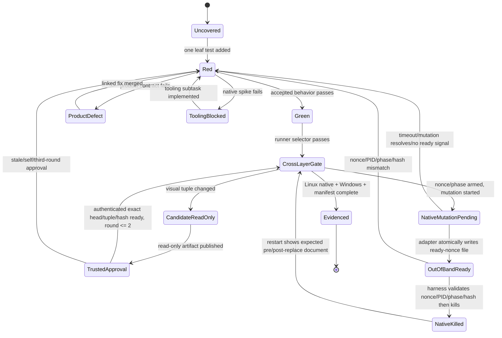
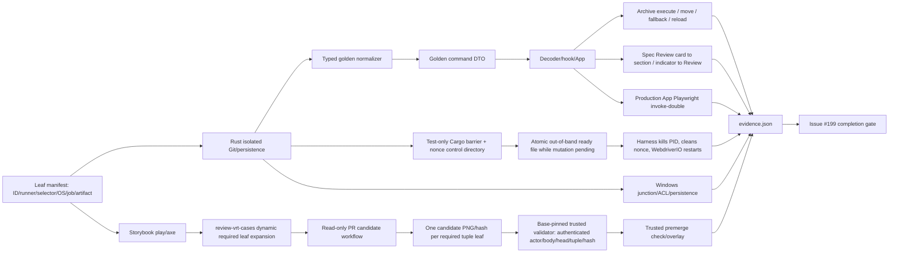

# Issue #199 Specs / Diff integrated review regression test plan

Issue: #199
Epic: #190 Specs / Diff integrated review Phase 1
Dependencies: #191–#198, #201–#203 (merged); documentation handoff: #200

## Goal

Phase 1 の Specs / repository Diff / Review を、純粋 domain から実 Git・永続化、IPC、production App、Storybook、visual regression まで追跡可能な回帰スイートにする。Issue #199 と ADR #191 の受け入れ条件を自動化または再現可能な手動証跡へ一対一で対応付け、Linux と Windows の必須 gate を固定する。

これは test / fixture / CI / evidence の計画であり、機能仕様は変更しない。Red が product defect を示した場合は期待値を弱めず、別の修正 task として切り出すか #199 の scope 変更を合意してから production code を直す。

## Current-state findings

- #191–#198 と #201–#203 は merged。#199 と Docs の #200 が epic #190 の未完了 issue である。
- 現在は frontend test file 174、Storybook story file 45、Rust test attribute 420。#198 は production `App` を使う Chromium 13 journey、Diff comment Storybook play / axe 7 case、Windows の全 Rust test / clippy gate を追加済みである。
- `pnpm test:e2e` は `diff-comments.spec.ts` だけ、`pnpm test:e2e:storybook` は `storybook-diff-comments.spec.ts` だけを実行する。前者は production App component を通るが、`window.__TAURI_INTERNALS__.invoke` を localStorage-backed stateful double へ置換するため、実 Git、実 JSON、native Tauri process の証拠ではない。
- Rust には base 推定、committed / staged / unstaged / untracked、rename / delete / binary / large、Unicode / non-UTF-8 / symlink escape、Diff comment schema / CAS / atomic replace / relocation の fixture がある。一方、それらと decoder、App journey を束ねる acceptance manifest はない。
- App Storybook は empty shell と disabled Diff の確認が中心。各 feature story は豊富だが、workspace → Specs / Diff → Review の cross-feature 状態を一覧できない。
- VRT は全 story を 1280×720 で撮影し 0.2% を超える差分を fail するが、capture 前に story `play` / axe の成功を要求せず、dark / narrow acceptance set と snapshot 安定性 budget を明示していない。
- #197 / #198 の large-view test は DOM 上限、semantic jump、warm-up 後の反復 median ratio を持つ。#199 は wall-clock 500 ms の単発閾値を追加せず、projection / invoke count と DOM budget を cross-feature で固定する。
- Vitest include は `src/**/*.{test,spec}.{ts,tsx}` に限定される。acceptance manifest/test/fixture は `src/tests/acceptance/` と `src/tests/fixtures/` に置き、未実行の root `tests/` を増やさない。
- App/Storybook Playwright config は各1 specの exact match。#199 specを明示配列へ追加し、scripts/CIが意図したsuiteを列挙することをconfig testで固定する。

## Scope

### In scope

- Issue #199 / ADR #191 の acceptance manifest、fixture catalog、dependency / evidence matrix。
- 不足する Rust domain・Git adapter・persistence・command integration regression。
- frontend domain / decoder / hook / App integration regression。
- cross-feature Storybook stories、play、axe、light / dark / narrow states。
- production App + stateful invoke Playwright、実 Rust fixture trace、native packaged-app smoke の役割分離。
- VRT allowlist / viewport matrix / stability、performance budgets、Linux / Windows CI gates。
- 自動化できない確認の環境・fixture・操作・期待結果を記した manual evidence。

### Out of scope

- #191–#198 の機能、schema、UI、永続化仕様の変更。
- Diff comment export / MCP、reply、delete、arbitrary revision、stage / commit / discard。
- VRT baseline を差分確認なしに更新すること。
- macOS / Linux / Windows の完全な desktop E2E。native smoke は起動、workspace load、実 command round-trip、再起動復元という最小契約に限定する。

## Test architecture decisions

### 1. Acceptance manifest is the source of truth

`src/tests/acceptance/review-phase-1.ts` に machine-verifiable な leaf evidence を置く。1 leaf は1 behaviorだけを表し、`id`、`requirement`、`runner`、`selector`、`os`、`ciJob`、`artifact` を必須にする。validator は重複 ID、複合 behavior、空 selector、存在しない script/job/artifact、selector競合を fail する。manual-only は Issue #199 completion evidence として認めない。

ID は `R199-<AREA>-<NNN>`。test title は同じ `[R199-AREA-NNN]` を含む。Vitest は `-t`、Playwright は `--grep`、Storybook/VRT は story tuple key で単独再実行できる。Cargo selectorはunique suffixをmanifestへ置き、`cargo test -- --list` resolverがexactly one fully-qualified test nameへ解決してから、その完全名を`cargo test <fully-qualified> -- --exact`で実行する。0件/複数件はfailする。短いCargo filterの直接実行は禁止する。CI はmanifestとrunner reportから`evidence.json`を生成し、result/target mappingの欠けたleafをfailする。

`targets`はdiscriminated unionの配列 `ReadonlyArray<{ os: "ubuntu-24.04" | "windows-latest"; ciJob: CiJobId; artifact: ArtifactId }>` とする。`Linux+Windows`やslash結合文字列は禁止し、同一behaviorを両OSで要求する場合もOS別leaf/target recordに分ける。

### 2. Cross-layer trace without pretending the browser is native

同じ fixture vocabularyを Rust fixture、frontend decoder fixture、stateful invoke scenario で共有する。値を直接importせず、normalizer経由のgolden command JSONでschema driftを結ぶ。

| Layer | Proves | Does not prove |
|---|---|---|
| Rust real-repo integration | Git state、base、tree、content、persistence、restart、atomicity | browser wiring / focus |
| decoder / hook / App tests | DTO validation、stale settlement、navigation state | native filesystem |
| Chromium production App | user flow、keyboard、focus、theme、viewport | real Tauri process |
| Linux native smoke | native invoke、real workspace、restart restore | exhaustive UI matrix |

### 3. Deterministic golden normalization

`scripts/normalize-review-fixture.mjs` は absolute temp path、repository/worktree ID、SHA、snapshot ID、timestamp、platform separatorだけを型付き placeholderへ置換する。unknown volatile field、key削除、任意文字列正規化はrejectする。同一 raw ID→同一 placeholder、異なる ID→異なる placeholder、envelope/anchor/worktree/pathの参照一致、side/path/revision/comment ID不変をtestする。golden metadataは生成command、raw hash、normalizer versionを持つ。

### 4. Filesystem, Git, persistence boundaries

- tracked/ignored/untracked/binary/Unicode/non-UTF8/symlink、Windows junction/reparse point、`.git` directory/file、generated directoryを別leafにする。`.git`だけを全filterで常時除外する。generated directoryはChangedでは除外し、Allではdeferred nodeとして表示して明示展開時だけlazy loadする。symlink/junction escapeはtyped rejection。
- Git subprocess harnessはglobal/system config、credential/helper、safe.directory、localeを隔離し、fixed author/committer、`GIT_CONFIG_NOSYSTEM=1`、fixture-local configだけを与える。main/master/remote HEAD/gh/overrideは独立fixtureにする。
- permission errorはfilesystem/persistence portのpermission-denied seamで決定的に検証し、Linux実権限command integrationとWindows ACL command integrationを別leafにする。Windows junction/reparse fixtureは通常ユーザーが作成できるNTFS junction/mount-point APIを使い、管理者権限・Developer Mode・skipを禁止する。fixture setup失敗もtest failureにする。
- restartはstore再構築、native process terminate/relaunch、正常flush後再読を分ける。生存processでreplace成功後のdirectory sync失敗は`committed + durability uncertain`を返すleaf、replace後process crashはrestart後に新documentが見えるleafとして分離する。commit前crashは旧documentを維持し、power-lossを主張しない。
- Spec JSON v2 noninterferenceは双方向byte-for-byte。Diff mutation前後のSpec bytes、Spec mutation前後のDiff bytes、双方のlist/restart結果をLinux/Windowsで固定する。

### 5. Mandatory Linux native smoke and crash control

WebdriverIO + direct `tauri-driver` lifecycleを採用する。`wdio.native.conf.ts` が fixture と `pnpm tauri build --debug --no-bundle --features native-test-control` を準備し、CIは `xvfb-run -a tauri-driver --port 4444` を起動する。trap/onCompleteはapp → WebDriver session → tauri-driver → Xvfbの順に終了しPID/logをartifact化する。

native crashはtest-only Cargo feature `native-test-control` とout-of-band control directoryで決定的に作る。harnessは予測不能なnonce、所有者限定control directory、対象phaseを起動時に渡し、mutationを開始するがawaitしない。persistence adapterがpre-replaceまたはpost-replace barrierへ到達すると、`ready-<nonce>.json`（nonce、PID、phase、document hash）をtemp file + atomic renameで書き、mutation threadはrelease file/pipeを待って停止する。harnessはmutation responseではなくOS filesystem notification/pollでready fileを検証してPIDをkillする。mutation promiseは決してresolveせず、`barrierReached` responseや同一command内handshakeは禁止する。

各caseは起動前にstale nonce/control fileを除去し、timeout・PID/phase/hash不一致をfailし、kill/restart後にready/temp/release fileとcontrol directoryをcleanupする。release file/pipeはtest teardownがkill不能時にだけblocked threadを解放する。nonce再利用、別process signal、残留control fileはrejectする。feature、arm command、barrier、control pathは`cfg(feature = "native-test-control")`で囲み、default/通常debug/release/packageから除外する。CIは通常build metadata/binary/command registryにfeature、symbol、control pathが無いことを検証する。

Ubuntu 24.04へ`webkit2gtk-driver`、`xvfb`、`dbus-x11`を導入する。実Git open → command → comment create →正常restart restore、out-of-band pre-replace ready → kill →旧document、out-of-band post-replace ready → kill →新documentを別native leafにする。native jobはrequiredで、tooling spike失敗はblocking subtaskとなりmanualでは完了できない。

### 6. Trusted VRT approval protocol

PR candidate workflow is read-only: `pull_request`、`permissions: contents: read`、secretsなし、write APIなしでPR codeをbuild/capture/compareし、candidate `(storyId, theme, viewport, imageHash, headSha)` artifactだけを生成する。candidate workflowはapproval判定やcheck更新をしない。

write権限を持つtrusted approval workflowは`workflow_run`と`issue_comment`/`pull_request_review` eventを使い、default/base branchへpinされたvalidatorだけをcheckoutする。PR branch、candidate script、candidate executableを実行しない。GitHub event/APIからauthenticated actor、actor permission、review/comment body、PR head SHAを取得し、body内のexact tuple/hash/head/`ready: true`をcandidate artifactと照合する。自己承認、編集済み/stale body、head/hash/tuple不一致をrejectする。

trusted workflowだけがpremerge expected overlay/check conclusionを書き、main baselineはmerge後deployだけが更新する。approval roundは2回まで。3回目はfailしUI owner reviewを要求する。actor/body event ID/head/tuple/hash/ready/round/validator base SHAを`visual-approval-evidence.json`へ残す。

#199はこのtrusted workflowとvalidatorを初めてdefault branchへ導入するbootstrap PRである。GitHubは`workflow_run`をdefault branch上のworkflow定義からだけ起動するため、#199自身はread-only candidate artifactの独立確認、ローカル16 tuple capture、workflow/protocol auditを証跡にし、trusted checkをrequiredとはしない。merge後は#200以降のPRでtrusted checkをrequiredにし、この例外を再利用しない。

`review-vrt-cases.json` の各required `(storyId, theme, viewport)` tupleは `R199-VRTCASE-NNN` leaf IDを必須にする。manifest loaderはtupleからleafを動的展開し、candidate `stories.json`/image hashとevidenceをinner joinする。tuple重複、leaf重複、required tupleのcandidate 0件/複数件、candidateの未宣言tuple、evidenceの0件/複数件をfailする。よってrequired tuple、candidate PNG/hash、approval/evidence recordは一対一である。

### 7. Deterministic performance budgets

- Git fixture は固定author/date、明示branch/remote HEAD、固定bytesを使う。
- UI fixture はdeferred promiseと固定ID/timestampを使いsleepやtest内分岐を置かない。
- All toggleでsnapshot command count不変、ignored child commandは明示展開時だけ1増加をspy/traceする。
- large tree/diff/Reviewはprojection count、visible DOM cap、materialized target focusを必須にする。timingはwarm-up後7回以上のmedian ratioをdiagnosticとし絶対時間単独ではfailさせない。

## System diagrams

### Evidence and native-spike state machine



### Data and evidence flow



## Dependency matrix

| Dependency | Merged contract reused | #199 regression evidence |
|---|---|---|
| #191 ADR | mode/filter scope, base priority, progress, anchor/CAS | manifest plus domain/persistence tables |
| #192 workspace | repository/worktree selection and mode state | A→B→A, Specs/Diff switch journeys |
| #193 Specs | implicit root, archive, progress, artifact tabs | hierarchy and reload fallback cases |
| #194 tree | Changed/All, ignored lazy tree, status classes | real Git matrix and no-recompute count |
| #195 tabs | multi-file selection and close fallback | App/tab keyboard and deleted-file race |
| #196 Unified/Split | shared hunks, binary/large/missing | projection tables, stories, VRT |
| #197 Editor | current content, peek, windowing, stable jump | cross-view invariant and off-window focus |
| #198 comments | JSON v1, CAS, resolution, shared Review | restart, conflict/overflow, filter/jump |
| #201–#203 backend | Git adapter, commands, Specs bundle | real repository/command fixtures |
| #200 Docs | supported/unsupported behavior | manual evidence and limitation handoff |

## Planned file changes

- Add `src/tests/acceptance/review-phase-1.ts`, `review-phase-1.validation.test.ts`, and `review-vrt-cases.json`; current Vite include already executes these, so no include expansion is needed.
- Add `src/tests/fixtures/review-phase-1/` golden DTOs/metadata, `scripts/normalize-review-fixture.mjs`, and `scripts/run-cargo-leaf.mjs`; resolver uses `cargo test -- --list`, requires one fully-qualified suffix match, then runs `--exact`.
- Update Rust tests in `src-tauri/src/infrastructure/git/repository.rs`, `infrastructure/persistence/{diff_comment_store,atomic_replace}.rs`, `app/use_cases/{repository_diff,diff_comments}.rs`, and `presentation/commands/{repository,diff_comments}.rs`; include env isolation, `.git` exclusion, generated Changed/All behavior, committed/staged/unstaged aggregation, durability/crash, permission command seams, and bidirectional byte assertions.
- Add privilege-free, no-skip Windows tests for NTFS junction/reparse escape, ACL-denied command integration, atomic replace, and Spec v2 ↔ Diff v1 byte noninterference. Fixture creation failure is a failure.
- Update frontend tests under `src/lib/api/tauri/__tests__/`, feature `__tests__/`, and `src/app/App/__tests__/App.state.test.tsx`; add archive command/result/selection/reload and Spec Review↔section jumps as independent leaf tests.
- Add `src/app/App/ReviewRegression.stories.tsx` and focused stories for Specs hierarchy, Changed/All, three views, Review/errors, theme, and narrow viewport.
- Extract stateful invoke scenarios into `e2e/support/review-invoke-boundary.ts`; add `e2e/review-regression.spec.ts` and `e2e/storybook-review-regression.spec.ts`.
- Update `playwright.config.ts` testMatch to `['diff-comments.spec.ts', 'review-regression.spec.ts']`; update `playwright.storybook.config.ts` to the two Storybook specs. Add `src/tests/acceptance/playwright-config.validation.test.ts` to assert disjoint exact arrays.
- Add package scripts `test:e2e:app`, `test:e2e:storybook`, `test:e2e:native`, and `test:acceptance:evidence`; keep `test:e2e` as the explicit App alias, never a glob that captures Storybook/native.
- Add `wdio.native.conf.ts`, `e2e-native/{review-restart,review-crash}.e2e.ts`, and `e2e-native/support/native-crash-control.ts`. Add test-only Cargo barrier/control module which atomically writes nonce-scoped ready files while mutation remains pending; lifecycle owns timeout, PID validation, kill, emergency release, stale nonce cleanup, and release-exclusion assertion. No Playwright native config is used.
- Update `scripts/storybook-visual-regression.mjs`; add `scripts/expand-vrt-leaves.mjs` for one-to-one required tuple/candidate/evidence validation and base-branch `scripts/validate-visual-approval.mjs`. Split candidate/trusted workflows; trusted workflow never checks out or executes PR code.
- Update `.github/workflows/frontend.yml` with exact App, Storybook, acceptance-evidence jobs and add required `native-review-smoke` with Xvfb/Tauri deps. Update `.github/workflows/backend.yml` Windows job names/artifacts for reparse/ACL/noninterference evidence.
- Add `docs/testing/review-phase-1-regression.md` for commands, fixture normalization, native lifecycle, VRT approval, evidence lookup, and #200 handoff.

Production behavior/schema are not planned changes. The sole production-tree addition is compile-time-gated `native-test-control`; it is absent from default/release builds. If another Red proves a product defect, stop and link a separate fix before changing behavior.

## TDD implementation sequence

1. **Red — executable manifest.** Put one intentionally unresolved leaf under `src/tests`; prove validator and evidence aggregation fail. Green: bind one existing Vitest selector. Refactor: add runner adapters without weakening required fields.
2. **Red — native tooling spike.** Launch direct `tauri-driver` under Xvfb and execute one `load_workspace` round-trip. Green: deterministic PID/port/build lifecycle. If Red remains, open/implement the blocking tooling subtask; do not advance #199 to Done.
3. **Red/Green — golden normalizer.** Add one stable placeholder, triangulate distinct/repeated identities, then path/timestamp/platform separators. Reject unknown volatility and prove referential invariants.
4. **Red/Green — Git boundaries.** One leaf at a time: local/remote base candidates (symbolic remote HEAD and missing remote HEAD separately), detached/unborn/shallow, committed/staged/unstaged and combined snapshot, each status, non-Spec file, binary/Unicode/non-UTF8, symlink, `.git` exclusion, generated Changed exclusion/All lazy inclusion, then privilege-free Windows junction/reparse. Isolate Git environment first.
5. **Red/Green — persistence boundaries.** Revision 0, increment, conflict, overflow, invalid input, envelope mismatch, Linux permission command, Windows ACL command, pre-replace crash, alive post-replace sync failure, post-replace process crash, store restart, worktree isolation. Add Spec→Diff and Diff→Spec byte noninterference as OS-specific leaves.
6. **Red/Green — frontend leaf behavior.** Add decoder/domain/hook/App leaves in normal → boundary → stale/error order. Archive execute, move result, selection fallback, reload placement are four Red/Green cycles. Spec Review card→section and indicator→Review are two more cycles. Bind existing #197/#198 first.
7. **Red/Green — Storybook and accessibility.** Add each required state story, its play selector, then default/dark/narrow axe leaves. Focus destination and semantic name are separate assertions/leaves.
8. **Red/Green — App Playwright.** Extract invoke-double support, update exact config arrays, prove App and Storybook suites cannot cross-match, then add one behavior per Playwright test title.
9. **Red/Green — native restart/crash.** Add gated control directory and nonce validation; start mutation without awaiting; atomically signal ready out-of-band; prove mutation is pending; validate signal then kill PID; restart/assert; cleanup. Repeat for pre/post-replace. Add timeout, wrong nonce/PID/phase/hash, emergency release, stale cleanup, and default/release exclusion leaves.
10. **Red/Green — VRT protocol.** Expand every required JSON tuple into its named VRTCASE leaf; prove tuple↔candidate↔evidence one-to-one before approval. Then prove read-only candidate and base-pinned trusted actor/body/head/tuple/hash validation, stale/self rejection, premerge result, and repeat cap without PR-code execution.
11. **Red/Green — performance.** Snapshot invocation count, lazy child invocation, DOM row/card cap, off-window focus, and median diagnostic are separate leaves.
12. **Refactor/full evidence.** Remove duplicate fixtures, generate `evidence.json`, run Linux/Windows/native/VRT gates, and fail completeness until every leaf has a successful artifact.

Every cycle is one failing observable and minimal Green. No `describe`, test branching, arbitrary sleep, semantic snapshot-only assertion, or selector shared by multiple behavior leaves is allowed.

## Machine-verifiable acceptance leaves

The checked-in manifest contains the complete form of this table. `selector` values below are stable prefixes; implementation must use the exact value and runner syntax declared by the manifest.

| Leaf ID | One behavior | Runner / selector | OS | CI job | Artifact |
|---|---|---|---|---|---|
| R199-NAV-001 | workspace selection loads one worktree | Playwright `^\\[R199-NAV-001\\]` | ubuntu-24.04 | app-review-e2e | app-playwright |
| R199-NAV-002 | worktree A→B→A preserves isolated state | Playwright `^\\[R199-NAV-002\\]` | ubuntu-24.04 | app-review-e2e | app-playwright |
| R199-NAV-003 | Specs tab switches to Diff tab | Playwright `^\\[R199-NAV-003\\]` | ubuntu-24.04 | app-review-e2e | app-playwright |
| R199-SPEC-001 | implicit Specs root is projected | Vitest `[R199-SPEC-001]` | ubuntu-24.04 | frontend-unit | frontend-junit |
| R199-SPEC-002 | archive node is projected | Vitest `[R199-SPEC-002]` | ubuntu-24.04 | frontend-unit | frontend-junit |
| R199-SPEC-003 | unknown progress is exposed | Vitest `[R199-SPEC-003]` | ubuntu-24.04 | frontend-unit | frontend-junit |
| R199-SPEC-005 | processing progress is exposed | Vitest `[R199-SPEC-005]` | ubuntu-24.04 | frontend-unit | frontend-junit |
| R199-SPEC-006 | completed progress is exposed | Vitest `[R199-SPEC-006]` | ubuntu-24.04 | frontend-unit | frontend-junit |
| R199-SPEC-007 | failed progress is exposed | Vitest `[R199-SPEC-007]` | ubuntu-24.04 | frontend-unit | frontend-junit |
| R199-SPEC-008 | artifact count matches present documents | Vitest `[R199-SPEC-008]` | ubuntu-24.04 | frontend-unit | frontend-junit |
| R199-SPEC-004 | multiple Markdown artifacts retain tabs | Playwright `^\\[R199-SPEC-004\\]` | ubuntu-24.04 | app-review-e2e | app-playwright |
| R199-ARCH-001 | archive action invokes archive command once | Vitest `[R199-ARCH-001]` | ubuntu-24.04 | frontend-unit | frontend-junit |
| R199-ARCH-002 | successful archive moves spec under Archive | Playwright `^\[R199-ARCH-002\]` | ubuntu-24.04 | app-review-e2e | app-playwright |
| R199-ARCH-003 | archiving selected spec chooses deterministic fallback | Vitest `[R199-ARCH-003]` | ubuntu-24.04 | frontend-unit | frontend-junit |
| R199-ARCH-004 | reload retains archived placement | Playwright `^\[R199-ARCH-004\]` | ubuntu-24.04 | app-review-e2e | app-playwright |
| R199-TREE-001 | Changed projects added status | Cargo suffix `r199_tree_001_added` | ubuntu-24.04 | backend-check | backend-junit |
| R199-TREE-007 | Changed projects modified status | Cargo suffix `r199_tree_007_modified` | ubuntu-24.04 | backend-check | backend-junit |
| R199-TREE-008 | Changed projects deleted status | Cargo suffix `r199_tree_008_deleted` | ubuntu-24.04 | backend-check | backend-junit |
| R199-TREE-009 | Changed projects untracked status | Cargo suffix `r199_tree_009_untracked` | ubuntu-24.04 | backend-check | backend-junit |
| R199-TREE-010 | All projects ignored status | Cargo suffix `r199_tree_010_ignored` | ubuntu-24.04 | backend-check | backend-junit |
| R199-TREE-011 | Changed projects binary status | Cargo suffix `r199_tree_011_binary` | ubuntu-24.04 | backend-check | backend-junit |
| R199-TREE-002 | All includes unchanged files | Playwright `^\\[R199-TREE-002\\]` | ubuntu-24.04 | app-review-e2e | app-playwright |
| R199-TREE-003 | All toggle does not reload snapshot | Vitest `[R199-TREE-003]` | ubuntu-24.04 | frontend-unit | frontend-junit |
| R199-TREE-004 | ignored directory loads only on expansion | Vitest `[R199-TREE-004]` | ubuntu-24.04 | frontend-unit | frontend-junit |
| R199-TREE-005 | `.git` is never traversed | Cargo suffix `r199_tree_005_git_boundary` | ubuntu-24.04 | backend-check | backend-junit |
| R199-TREE-006 | Changed excludes generated directory | Cargo suffix `r199_tree_006_generated_changed_excluded` | ubuntu-24.04 | backend-check | backend-junit |
| R199-TREE-013 | All includes generated directory as deferred | Cargo suffix `r199_tree_013_generated_all_deferred` | ubuntu-24.04 | backend-check | backend-junit |
| R199-TREE-014 | generated children load only after All expansion | Vitest `[R199-TREE-014]` | ubuntu-24.04 | frontend-unit | frontend-junit |
| R199-GIT-010 | local main is selected before fallback | Cargo suffix `r199_git_010_main_priority` | ubuntu-24.04 | backend-check | backend-junit |
| R199-GIT-011 | local master is selected when main is absent | Cargo suffix `r199_git_011_master_fallback` | ubuntu-24.04 | backend-check | backend-junit |
| R199-GIT-012 | shallow missing merge-base is typed | Cargo suffix `r199_git_012_shallow` | ubuntu-24.04 | backend-check | backend-junit |
| R199-GIT-013 | detached HEAD state is typed | Cargo suffix `r199_git_013_detached` | ubuntu-24.04 | backend-check | backend-junit |
| R199-GIT-014 | Unicode repository path is preserved | Cargo suffix `r199_git_014_unicode` | ubuntu-24.04 | backend-check | backend-junit |
| R199-GIT-015 | rename retains old and new paths | Cargo suffix `r199_git_015_rename_paths` | ubuntu-24.04 | backend-check | backend-junit |
| R199-GIT-016 | large content is typed omitted | Cargo suffix `r199_git_016_large_omitted` | ubuntu-24.04 | backend-check | backend-junit |
| R199-GIT-018 | committed change enters snapshot | Cargo suffix `r199_git_018_committed` | ubuntu-24.04 | backend-check | backend-junit |
| R199-GIT-019 | staged change enters snapshot | Cargo suffix `r199_git_019_staged` | ubuntu-24.04 | backend-check | backend-junit |
| R199-GIT-020 | unstaged change enters snapshot | Cargo suffix `r199_git_020_unstaged` | ubuntu-24.04 | backend-check | backend-junit |
| R199-GIT-021 | committed staged unstaged combine once | Cargo suffix `r199_git_021_combined` | ubuntu-24.04 | backend-check | backend-junit |
| R199-GIT-022 | non-Spec text file is reviewable | Cargo suffix `r199_git_022_non_spec` | ubuntu-24.04 | backend-check | backend-junit |
| R199-GIT-001 | Git global config cannot alter base | Cargo suffix `r199_git_001_env_isolation` | ubuntu-24.04 | backend-check | backend-junit |
| R199-GIT-002 | symbolic remote HEAD selects its target | Cargo suffix `r199_git_002_symbolic_remote_head` | ubuntu-24.04 | backend-check | backend-junit |
| R199-GIT-017 | missing remote HEAD falls through priority | Cargo suffix `r199_git_017_missing_remote_head` | ubuntu-24.04 | backend-check | backend-junit |
| R199-GIT-003 | gh merge-base candidate is deterministic | Cargo suffix `r199_git_003_gh_merge_base` | ubuntu-24.04 | backend-check | backend-junit |
| R199-GIT-004 | override wins base selection | Cargo suffix `r199_git_004_override` | ubuntu-24.04 | backend-check | backend-junit |
| R199-GIT-005 | unborn HEAD is typed | Cargo suffix `r199_git_005_unborn` | ubuntu-24.04 | backend-check | backend-junit |
| R199-GIT-006 | non-UTF8 path is typed error | Cargo suffix `r199_git_006_non_utf8` | ubuntu-24.04 | backend-check | backend-junit |
| R199-GIT-007 | symlink escape is rejected | Cargo suffix `r199_git_007_symlink_escape` | ubuntu-24.04 | backend-check | backend-junit |
| R199-GIT-008 | junction escape is rejected | Cargo suffix `r199_git_008_junction_escape` | windows-latest | windows-review | windows-junit |
| R199-GIT-009 | reparse point is not followed | Cargo suffix `r199_git_009_reparse_boundary` | windows-latest | windows-review | windows-junit |
| R199-VIEW-004 | view mode is session-global across files | Vitest `[R199-VIEW-004]` | ubuntu-24.04 | frontend-unit | frontend-junit |
| R199-VIEW-005 | base-resolution error remains actionable | Storybook `app-reviewregression--base-error` | ubuntu-24.04 | storybook-review-e2e | storybook-playwright |
| R199-VIEW-001 | Unified retains active file tab | Playwright `^\\[R199-VIEW-001\\]` | ubuntu-24.04 | app-review-e2e | app-playwright |
| R199-VIEW-002 | Split retains active file tab | Playwright `^\\[R199-VIEW-002\\]` | ubuntu-24.04 | app-review-e2e | app-playwright |
| R199-VIEW-003 | Editor retains active file tab | Playwright `^\\[R199-VIEW-003\\]` | ubuntu-24.04 | app-review-e2e | app-playwright |
| R199-VIEW-006 | Changed All Unified Split Editor share snapshot identity | Vitest `[R199-VIEW-006]` | ubuntu-24.04 | frontend-unit | frontend-junit |
| R199-REVIEW-001 | Spec section creates a comment | Playwright `^\\[R199-REVIEW-001\\]` | ubuntu-24.04 | app-review-e2e | app-playwright |
| R199-REVIEW-002 | Diff line creates a comment | Playwright `^\\[R199-REVIEW-002\\]` | ubuntu-24.04 | app-review-e2e | app-playwright |
| R199-REVIEW-006 | Open filter excludes resolved comments | Vitest `[R199-REVIEW-006]` | ubuntu-24.04 | frontend-unit | frontend-junit |
| R199-REVIEW-003 | resolve changes status filter result | Playwright `^\\[R199-REVIEW-003\\]` | ubuntu-24.04 | app-review-e2e | app-playwright |
| R199-REVIEW-004 | card jump focuses line indicator | Playwright `^\\[R199-REVIEW-004\\]` | ubuntu-24.04 | app-review-e2e | app-playwright |
| R199-REVIEW-005 | line indicator selects Review card | Playwright `^\\[R199-REVIEW-005\\]` | ubuntu-24.04 | app-review-e2e | app-playwright |
| R199-REVIEW-007 | Spec Review card jump focuses anchored section | Playwright `^\[R199-REVIEW-007\]` | ubuntu-24.04 | app-review-e2e | app-playwright |
| R199-REVIEW-008 | Spec section indicator selects Review card | Playwright `^\[R199-REVIEW-008\]` | ubuntu-24.04 | app-review-e2e | app-playwright |
| R199-ANCHOR-001 | exact anchor retains side-path | Cargo suffix `r199_anchor_001_exact_side_path` | ubuntu-24.04 | backend-check | backend-junit |
| R199-ANCHOR-002 | relocated anchor retains side-path | Cargo suffix `r199_anchor_002_relocated_side_path` | ubuntu-24.04 | backend-check | backend-junit |
| R199-ANCHOR-003 | stale anchor cannot jump | Vitest `[R199-ANCHOR-003]` | ubuntu-24.04 | frontend-unit | frontend-junit |
| R199-STORE-001 | missing document loads revision zero | Cargo suffix `r199_store_001_revision_zero` | ubuntu-24.04 | backend-check | backend-junit |
| R199-STORE-002 | successful mutation increments revision | Cargo suffix `r199_store_002_increment` | ubuntu-24.04 | backend-check | backend-junit |
| R199-STORE-003 | stale expected revision returns conflict | Cargo suffix `r199_store_003_conflict` | ubuntu-24.04 | backend-check | backend-junit |
| R199-STORE-004 | maximum revision returns overflow | Cargo suffix `r199_store_004_overflow` | ubuntu-24.04 | backend-check | backend-junit |
| R199-STORE-005 | Linux denied path returns typed command error | Cargo suffix `r199_store_005_linux_permission_command` | ubuntu-24.04 | backend-check | backend-junit |
| R199-STORE-015 | Windows ACL denial returns typed command error | Cargo suffix `r199_store_015_windows_acl_command` | windows-latest | windows-review | windows-junit |
| R199-STORE-006 | Linux pre-replace crash preserves old bytes | Cargo suffix `r199_store_006_linux_prereplace_crash` | ubuntu-24.04 | backend-check | backend-junit |
| R199-STORE-017 | Windows pre-replace crash preserves old bytes | Cargo suffix `r199_store_017_windows_prereplace_crash` | windows-latest | windows-review | windows-junit |
| R199-STORE-007 | alive process reports uncertain after directory sync failure | Cargo suffix `r199_store_007_alive_uncertain` | ubuntu-24.04 | backend-check | backend-junit |
| R199-STORE-014 | post-replace process crash restores new document | Cargo suffix `r199_store_014_postreplace_crash` | ubuntu-24.04 | backend-check | backend-junit |
| R199-STORE-020 | Windows alive process reports uncertain after sync failure | Cargo suffix `r199_store_020_windows_alive_uncertain` | windows-latest | windows-review | windows-junit |
| R199-STORE-008 | Linux Diff mutation preserves Spec v2 bytes | Cargo suffix `r199_store_008_linux_diff_preserves_spec` | ubuntu-24.04 | backend-check | backend-junit |
| R199-STORE-018 | Windows Diff mutation preserves Spec v2 bytes | Cargo suffix `r199_store_018_windows_diff_preserves_spec` | windows-latest | windows-review | windows-junit |
| R199-STORE-009 | Linux Spec mutation preserves Diff v1 bytes | Cargo suffix `r199_store_009_linux_spec_preserves_diff` | ubuntu-24.04 | backend-check | backend-junit |
| R199-STORE-019 | Windows Spec mutation preserves Diff v1 bytes | Cargo suffix `r199_store_019_windows_spec_preserves_diff` | windows-latest | windows-review | windows-junit |
| R199-STORE-010 | worktrees use isolated documents | Cargo suffix `r199_store_010_worktree_isolation` | ubuntu-24.04 | backend-check | backend-junit |
| R199-STORE-011 | noncanonical revision is rejected | Cargo suffix `r199_store_011_invalid_revision` | ubuntu-24.04 | backend-check | backend-junit |
| R199-STORE-012 | envelope-anchor identity mismatch is rejected | Cargo suffix `r199_store_012_envelope_mismatch` | ubuntu-24.04 | backend-check | backend-junit |
| R199-STORE-013 | runtime resolution is absent from stored bytes | Cargo suffix `r199_store_013_runtime_not_stored` | ubuntu-24.04 | backend-check | backend-junit |
| R199-ERR-001 | unmanaged repository shows typed state | Storybook `app-reviewregression--unmanaged` | ubuntu-24.04 | storybook-review-e2e | storybook-playwright |
| R199-ERR-002 | read denial shows retryable state | Storybook `app-reviewregression--read-denied` | ubuntu-24.04 | storybook-review-e2e | storybook-playwright |
| R199-ERR-003 | stale response cannot replace current identity | Vitest `[R199-ERR-003]` | ubuntu-24.04 | frontend-unit | frontend-junit |
| R199-ERR-004 | deleted active file selects fallback | Vitest `[R199-ERR-004]` | ubuntu-24.04 | frontend-unit | frontend-junit |
| R199-A11Y-001 | keyboard jump moves focus to destination | Playwright `^\\[R199-A11Y-001\\]` | ubuntu-24.04 | app-review-e2e | app-playwright |
| R199-A11Y-002 | line control exposes side/path/line/action name | Vitest `[R199-A11Y-002]` | ubuntu-24.04 | frontend-unit | frontend-junit |
| R199-A11Y-003 | dark review story has no serious axe violation | Playwright `^\\[R199-A11Y-003\\]` | ubuntu-24.04 | storybook-review-e2e | storybook-playwright |
| R199-A11Y-004 | narrow review story has no serious axe violation | Playwright `^\\[R199-A11Y-004\\]` | ubuntu-24.04 | storybook-review-e2e | storybook-playwright |
| R199-PERF-001 | large tree keeps rendered node cap | Vitest `[R199-PERF-001]` | ubuntu-24.04 | frontend-unit | frontend-junit |
| R199-PERF-002 | large diff keeps rendered row cap | Vitest `[R199-PERF-002]` | ubuntu-24.04 | frontend-unit | frontend-junit |
| R199-PERF-003 | 10k Review keeps rendered card cap | Vitest `[R199-PERF-003]` | ubuntu-24.04 | frontend-unit | frontend-junit |
| R199-PERF-004 | off-window jump materializes focused target | Playwright `^\\[R199-PERF-004\\]` | ubuntu-24.04 | app-review-e2e | app-playwright |
| R199-NATIVE-001 | native app executes repository command | WebdriverIO `[R199-NATIVE-001]` | ubuntu-24.04 | native-review-smoke | native-smoke |
| R199-NATIVE-002 | native restart restores Diff comment | WebdriverIO `[R199-NATIVE-002]` | ubuntu-24.04 | native-review-smoke | native-smoke |
| R199-NATIVE-003 | native pre-replace crash keeps old document | WebdriverIO `[R199-NATIVE-003]` | ubuntu-24.04 | native-review-smoke | native-smoke |
| R199-NATIVE-004 | native post-replace crash restores new document | WebdriverIO `[R199-NATIVE-004]` | ubuntu-24.04 | native-review-smoke | native-smoke |
| R199-NATIVE-005 | normal release excludes native test control | Cargo suffix `r199_native_005_release_exclusion` | ubuntu-24.04 | native-review-smoke | native-smoke |
| R199-NATIVE-006 | mutation remains pending after out-of-band ready | WebdriverIO `[R199-NATIVE-006]` | ubuntu-24.04 | native-review-smoke | native-smoke |
| R199-NATIVE-007 | wrong nonce ready signal is rejected | WebdriverIO `[R199-NATIVE-007]` | ubuntu-24.04 | native-review-smoke | native-smoke |
| R199-NATIVE-008 | crash control files are cleaned after restart | WebdriverIO `[R199-NATIVE-008]` | ubuntu-24.04 | native-review-smoke | native-smoke |
| R199-VRTCASE-001 | Specs hierarchy light desktop tuple matches baseline | VRT tuple `app-reviewregression--specs-hierarchy\\|light\|1280x720` | ubuntu-24.04 | trusted-visual-approval | visual-approval-evidence |
| R199-VRTCASE-002 | Archive light desktop tuple matches baseline | VRT tuple `app-reviewregression--archive\|light\|1280x720` | ubuntu-24.04 | trusted-visual-approval | visual-approval-evidence |
| R199-VRTCASE-003 | progress states light desktop tuple matches baseline | VRT tuple `app-reviewregression--progress\|light\|1280x720` | ubuntu-24.04 | trusted-visual-approval | visual-approval-evidence |
| R199-VRTCASE-004 | Changed tree light desktop tuple matches baseline | VRT tuple `app-reviewregression--changed-tree\|light\|1280x720` | ubuntu-24.04 | trusted-visual-approval | visual-approval-evidence |
| R199-VRTCASE-005 | All lazy tree light narrow tuple matches baseline | VRT tuple `app-reviewregression--all-lazy\|light\|390x844` | ubuntu-24.04 | trusted-visual-approval | visual-approval-evidence |
| R199-VRTCASE-006 | Unified light desktop tuple matches baseline | VRT tuple `app-reviewregression--unified\|light\|1280x720` | ubuntu-24.04 | trusted-visual-approval | visual-approval-evidence |
| R199-VRTCASE-007 | Split dark desktop tuple matches baseline | VRT tuple `app-reviewregression--split\|dark\|1280x720` | ubuntu-24.04 | trusted-visual-approval | visual-approval-evidence |
| R199-VRTCASE-008 | Editor dark narrow tuple matches baseline | VRT tuple `app-reviewregression--editor\|dark\|390x844` | ubuntu-24.04 | trusted-visual-approval | visual-approval-evidence |
| R199-VRTCASE-009 | conflict composer light desktop tuple matches baseline | VRT tuple `app-reviewregression--conflict\|light\|1280x720` | ubuntu-24.04 | trusted-visual-approval | visual-approval-evidence |
| R199-VRTCASE-010 | stale comment dark desktop tuple matches baseline | VRT tuple `app-reviewregression--stale\|dark\|1280x720` | ubuntu-24.04 | trusted-visual-approval | visual-approval-evidence |
| R199-VRTCASE-011 | Review filters light desktop tuple matches baseline | VRT tuple `app-reviewregression--review-filters\|light\|1280x720` | ubuntu-24.04 | trusted-visual-approval | visual-approval-evidence |
| R199-VRTCASE-012 | convergence picker dark desktop tuple matches baseline | VRT tuple `app-reviewregression--convergence\|dark\|1280x720` | ubuntu-24.04 | trusted-visual-approval | visual-approval-evidence |
| R199-VRTCASE-013 | unmanaged repository light desktop tuple matches baseline | VRT tuple `app-reviewregression--unmanaged\|light\|1280x720` | ubuntu-24.04 | trusted-visual-approval | visual-approval-evidence |
| R199-VRTCASE-014 | base error light desktop tuple matches baseline | VRT tuple `app-reviewregression--base-error\|light\|1280x720` | ubuntu-24.04 | trusted-visual-approval | visual-approval-evidence |
| R199-VRTCASE-015 | read denial light desktop tuple matches baseline | VRT tuple `app-reviewregression--read-denied\|light\|1280x720` | ubuntu-24.04 | trusted-visual-approval | visual-approval-evidence |
| R199-VRTCASE-016 | deleted file light desktop tuple matches baseline | VRT tuple `app-reviewregression--deleted-file\|light\|1280x720` | ubuntu-24.04 | trusted-visual-approval | visual-approval-evidence |
| R199-VRTCASE-017 | required tuple expands to one candidate record | Node test `[R199-VRTCASE-017]` | ubuntu-24.04 | visual-candidate | visual-candidate |
| R199-VRTCASE-018 | required tuple expands to one final evidence record | Node test `[R199-VRTCASE-018]` | ubuntu-24.04 | trusted-visual-approval | visual-approval-evidence |
| R199-VRT-001 | exact tuple approval can green premerge | Node test `[R199-VRT-001]` | ubuntu-24.04 | trusted-visual-approval | visual-approval-evidence |
| R199-VRT-002 | stale head approval is rejected | Node test `[R199-VRT-002]` | ubuntu-24.04 | trusted-visual-approval | visual-approval-evidence |
| R199-VRT-003 | self approval is rejected | Node test `[R199-VRT-003]` | ubuntu-24.04 | trusted-visual-approval | visual-approval-evidence |
| R199-VRT-004 | third approval round is rejected | Node test `[R199-VRT-004]` | ubuntu-24.04 | trusted-visual-approval | visual-approval-evidence |
| R199-VRT-005 | candidate workflow has read-only permissions | workflow audit `[R199-VRT-005]` | ubuntu-24.04 | visual-candidate | visual-candidate |
| R199-VRT-006 | trusted validator is pinned to base branch | Node test `[R199-VRT-006]` | ubuntu-24.04 | trusted-visual-approval | visual-approval-evidence |
| R199-VRT-007 | trusted workflow never executes PR code | workflow audit `[R199-VRT-007]` | ubuntu-24.04 | trusted-visual-approval | visual-approval-evidence |
| R199-VRT-008 | authenticated comment body must match candidate tuple | Node test `[R199-VRT-008]` | ubuntu-24.04 | trusted-visual-approval | visual-approval-evidence |

Parameter tables may share setup, but each row has a distinct leaf ID, selector result, and `evidence.json` record. The manifest validator rejects one test result being used to satisfy multiple leaves.

## Storybook and VRT acceptance

Required tuples cover Specs hierarchy/archive/progress, Changed/All lazy tree, Unified/Split/Editor, composer/conflict/stale/overflow, Review filters/resolution/convergence, unmanaged/base/read/deleted states. Interactive stories run play first. Default/dark/narrow axe and each VRT tuple are independent leaves.

VRT captures deterministic ready/error states at 1280×720 and layout-critical 390×844 dark tuples. Required unstable stories fail. Loading animation is semantic-only unless frozen. Read-only candidate output is consumed only by the base-pinned trusted workflow. Authenticated review/comment actor/body and exact head/tuple/hash/ready approval can make the PR gate Green without executing PR code or modifying main baseline.

## Gates and exact commands

```bash
cd spec-viewer
pnpm format:check
pnpm lint
pnpm typecheck
pnpm test:run
pnpm build
pnpm build-storybook
pnpm test:e2e:app
pnpm test:e2e:storybook
pnpm test:e2e:native
pnpm test:acceptance:cargo
pnpm test:acceptance:evidence
cargo fmt --manifest-path src-tauri/Cargo.toml --all -- --check
cargo clippy --manifest-path src-tauri/Cargo.toml --workspace --all-targets -- -D warnings
cargo test --manifest-path src-tauri/Cargo.toml --workspace
```

`test:e2e:app` uses `playwright.config.ts`; `test:e2e:storybook` uses `playwright.storybook.config.ts`; `test:e2e:native` uses WebdriverIO and the test-only Cargo feature. `test:acceptance:cargo` resolves unique suffixes to fully-qualified exact tests. CI runs read-only VRT candidate and separate trusted approval workflows. Windows required job uses privilege-free junction/reparse fixtures with no skip and runs:

```powershell
cargo test --manifest-path src-tauri/Cargo.toml --target x86_64-pc-windows-msvc --no-default-features
cargo clippy --manifest-path src-tauri/Cargo.toml --target x86_64-pc-windows-msvc --all-targets -- -D warnings
```

## Definition of Done

- [ ] Every leaf has one behavior and typed `targets[{os, ciJob, artifact}]`; slash/combined mappings are rejected.
- [ ] Cargo suffix resolver finds exactly one fully-qualified test via `--list` and executes it with `--exact`.
- [ ] `evidence.json` is Green for every required leaf; manual evidence cannot replace a missing target.
- [ ] Archive command execution, tree move result, deterministic selection fallback, and reload placement are four independent Green leaves.
- [ ] Spec Review card→anchored section and Spec indicator→Review card are independent focus/selection leaves.
- [ ] `.git` alone is universally excluded; generated is Changed-excluded, All-deferred, and lazy-loaded after expansion.
- [ ] committed, staged, unstaged, combined snapshot, non-Spec file, and shared identity across Changed/All/three views pass.
- [ ] symbolic remote HEAD and missing remote HEAD fallback are independent Green leaves.
- [ ] App/Storybook Playwright arrays are exact/disjoint and acceptance tests run under current `src` include.
- [ ] Golden normalization preserves referential invariants; Git config/environment is isolated.
- [ ] Windows junction/reparse fixtures require no privilege and never skip; setup failure fails CI.
- [ ] Linux denied-path and Windows ACL denial pass through real command integration.
- [ ] alive post-replace sync failure returns committed/uncertain; post-replace crash restores the new document; pre-replace crash preserves old bytes.
- [ ] Spec v2 and Diff v1 byte noninterference passes both directions on both OS jobs.
- [ ] `native-test-control` writes nonce-scoped ready files atomically out-of-band while mutation remains pending; harness validates signal, kills PID, restarts, and cleans every control artifact. No mutation response carries barrier readiness.
- [ ] Test-control feature/command/path is absent from default/debug-without-feature/release/package builds.
- [ ] Candidate VRT workflow is read-only. Trusted workflow runs base-pinned validator only, never PR code, and verifies authenticated actor/body/head/tuple/hash/ready.
- [ ] Every required `review-vrt-cases.json` tuple has one VRTCASE leaf, one candidate PNG/hash record, and one final evidence record; 0/multiple/undeclared records fail.
- [ ] Trusted VRT rejects self/stale/third-round approval and records validator base SHA plus evidence.
- [ ] Storybook play/axe, theme/viewport VRT, deterministic performance, full frontend/backend/native/Windows gates pass.
- [ ] Unsupported product behavior goes to #200; missing native/tooling capability keeps #199 blocked.

## Reviewer resolution table

| Review requirement | Resolution in this plan | Verification point |
|---|---|---|
| generated and `.git` | `.git` always excluded; generated only Changed-excluded and All-lazy | TREE-005/006/013/014 |
| trusted VRT | read-only candidate; base-pinned authenticated trusted workflow never runs PR code | VRT-005–008 |
| VRT tuple evidence | dynamic required tuple expansion and one-to-one candidate/evidence join | VRTCASE-001–018 |
| archive regression | execute, move result, selection fallback, reload are independent | ARCH-001–004 |
| Spec bidirectional jump | Review card→section and indicator→Review are independent | REVIEW-007/008 |
| native crash handshake | nonce-scoped atomic ready file is out-of-band; mutation stays pending; harness validates/kills/cleans | NATIVE-003/004/006–008 |
| native release exclusion | feature/command/path absent without test-only feature | NATIVE-005 |
| durability split | alive uncertain differs from post-replace crash recovery | STORE-007/014/020, NATIVE-004 |
| Cargo selectors | suffix resolved through `--list` to one fully-qualified `--exact` name | cargo leaf resolver validation |
| typed targets | OS/job/artifact discriminated records; no slash strings | manifest validation |
| remote HEAD | symbolic target and missing fallback are separate | GIT-002/017 |
| Windows path safety | privilege-free junction/reparse fixture, no skip | GIT-008/009 |
| change sources | committed, staged, unstaged, combined are individual leaves | GIT-018–021 |
| snapshot identity | Changed/All/Unified/Split/Editor share one identity | VIEW-006 |
| non-Spec review | ordinary repository text file is reviewable | GIT-022 |
| permissions | Linux denied path and Windows ACL command integration | STORE-005/015 |
| persistence isolation | bidirectional byte equality with OS-specific targets | STORE-008/009/018/019 |
| acceptance discovery | `src/tests`, exact Playwright arrays, named scripts | config/manifest validation |

## Independent review guide

Select any leaf ID and reproduce exactly its runner/selector. Confirm its OS job and named artifact in `evidence.json`. Reject composite leaves, non-exact Cargo execution, missing archive/reload or Spec reverse-jump evidence, same-call `barrierReached` response, mutation resolving before kill, non-atomic/unnamespaced ready signal, stale control files, test-control in release, VRT tuple without exactly one candidate/evidence record, candidate writes, trusted PR-code execution, unauthenticated/stale approval, inherited Git config, or one-way/non-byte persistence checks.
